# Curso de Flask
Curso de Flask realizado en Platzi

[Clase 1 Introducción](#Clase-1-Introducción)

[Clase 2 ¿Cómo funcionan las aplicaciones web?](#Clase-2-Cómo-funcionan-las-aplicaciones-web)

[Clase 3 ¿Qué es Flask?](#Clase-3-Qué-es-Flask)

[Clase 4 Instalación de Python, pip y virtualenv](#Clase-4-Instalación-de-Python-pip-y-virtualenv)

[Clase 5 Hello World Flask](#Clase-5-Hello-World-Flask)

[Clase 6 Debugging en Flask](#Clase-6-Debugging-en-Flask)

[Clase 7 Request y Response](#Clase-7-Request-y-Response)

[Clase 8 Ciclos de Request y Response](#Clase-8-Ciclos-de-Request-y-Response)

[Clase 9 Templates con Jinja 2](#Clase-9-Templates-con-Jinja-2)

[Clase 10 Estructuras de control](#Clase-10-Estructuras-de-control)

[Clase 11 Herencia de templates](#Clase-11-Herencia-de-templates)

[Clase 12 Include y links](#Clase-12-Include-y-links)

[Clase 13 Uso de archivos estáticos: imágenes](#Clase-13-Uso-de-archivos-estáticos-imágenes)

[Clase 14 Configurar páginas de error](#Clase-14-Configurar-páginas-de-error)

[Clase 15 Flask Bootstrap](#Clase-15-Flask-Bootstrap)

[Clase 16 Configuración de Flask](#Clase-16-Configuración-de-Flask)

[Clase 17 Implementación de Flask-Bootstrap y Flask-WTF](#Clase-17-Implementación-de-Flask-Bootstrap-y-Flask-WTF)

[Clase 18 Uso de método POST en Flask-WTF](#Clase-18-Uso-de-método-POST-en-Flask-WTF)

[Clase 19 Desplegar Flashes (mensajes emergentes)](#Clase-19-Desplegar-Flashes-mensajes-emergentes)

[Clase 20 Pruebas básicas con Flask-testing](#Clase-20-Pruebas-básicas-con-Flask-testing)

[Clase 21 Planteamiento del proyecto: To Do List](#Clase-21-Planteamiento-del-proyecto-To-Do-List)

[Clase 22 App Factory](#Clase-22-App-Factory)

[Clase 23 Uso de Blueprints](#Clase-23-Uso-de-Blueprints)

[Clase 24 Blueprints II](#Clase-24-Blueprints-II)

[Clase 25 Base de datos y App Engine con Flask](#Clase-25-Base-de-datos-y-App-Engine-con-Flask)

[Clase 26 Configuración de Google Cloud SDK](#Clase-26-Configuración-de-Google-Cloud-SDK)

[Clase 27 Configuración de proyecto en Google Cloud Platform](#Clase-27-Configuración-de-proyecto-en-Google-Cloud-Platform)

[Clase 28 Implementación de Firestore](#Clase-28-Implementación-de-Firestore)

[Clase 29 Autenticación de usuarios: Login](#Clase-29-Autenticación-de-usuarios-Login)

[Clase 30 Autenticación de usuarios: Logout](#Clase-30-Autenticación-de-usuarios-Logout)

[Clase 31 Signup](#Clase-31-Signup)

[Clase 32 Agregar tareas](#Clase-32-Agregar-tareas)

[Clase 33 Eliminar tareas](#Clase-33-Eliminar-tareas)

[Clase 34 Editar tareas](#Clase-34-Editar-tareas)


## Clase 1 Introducción

Conoce todo el potencial de Flask como framework web de Python, integraciones con Bootstrap, GCloud, What The Forms y más.

Flask es sencillo de aprender, tiene una documentación clara y práctica, es rápido a la hora de renderizar puede ser hasta tres veces más rapido que Django. También es fácil de realizar una API REST, la estructura de un proyecto es flexible y es ideal para aprender desarrollo web con un framework de Python.

## Clase 2 ¿Cómo funcionan las aplicaciones web?

Cuando utilizas una aplicación web puedes interactuar con ella desde una computadora hasta un dispositivo móvil, pero esto no quiere decir que consume el procesamiento de tu dispositivo. Todo lo contrario, se hace en una red de servidores.

Estos servidores unen su poder de procesamiento con el fin transmitir solicitudes a todo el mundo, a su vez utilizar servidores especializados para almacenar los datos con los cuales se está trabajando, así como los datos de los demás usuarios. Como todo esto sucede sin demora alguna, parecerá que la aplicación se está ejecutando de forma nativa en tu dispositivo.

El servidor procesa la información obtenida por el navegador, luego se realizan los procedimientos necesarios de acuerdo a la lógica de negocio de la aplicación para regresar la información solicitada al cliente.

**Ejemplo:**

Cuando utilizamos Google Drive el cual es una aplicación web y abrimos un documento con Google Docs, el navegador se comunica con los servidores para ver y editar el documento.

A medida que vayas editando el documento, tu navegador trabajará de la mano con los servidores para asegurarse que todos los cambios se estén guardando.

**Ventajas:**

- Muchas de las aplicaciones web que existen son gratuitas.

- Puedes acceder a tu información en cualquier momento y lugar.

- No dependes de un dispositivo en específico ya que la aplicación se encuentra almacenada en la web.

## Clase 3 ¿Qué es Flask?

En esta clase el profesor Bernardo Cassina nos explica cómo podemos usar Flask para desarrollar aplicaciones web escritas en Python con este framework.

Flask es un framework minimalista escrito en Python que permite crear aplicaciones web rápidamente y con un mínimo de líneas de código, busca que su infraestructura inicial sea lo más simple posible y pueda personalizarse fácilmente, no depende de un sistema de autenticacion especifico o base de datos especifico, puedes extender sus funcionalidades con las llamadas Flask Extensions http://flask.pocoo.org/extensions/

Flask utiliza un template engine que se llama Jinja2 el cual tiene similitudes con Django, es simple, no tiene arquitectura especifica.

## Clase 4 Instalación de Python, pip y virtualenv

**Esta es la guía para configurar nuestro ambiente con Python 3.**

Por lo general Mac ya incluye una instalación de Python, la puedes verificar ejecutando los siguientes comandos en una terminal:
```
python --version
```
```
python3 --version
```

Debemos asegurarnos de tener python 3. Para instalar Python puedes seguir el siguiente enlace y después regresar a esta lectura.

https://platzi.com/clases/1378-python/14289-guia-de-instalacion-y-conceptos-basicos/

**Instalación en Windows**

Una vez que instalaste python 3 desde python.org vamos a verificar que también incluimos pip en esta instalación. Después debes correr el siguiente comando para instalar virtualenv:

```
pip install virtualenv
```

El sistema debe haber instalado virtualenv y ahora podemos comenzar con el curso.

**Instalación en Mac**

Si ya instalaste python 3 ahora corre el siguiente comando para instalar pip:

```
sudo easy_install pip
```

Para install virtualenv de manera global corre:

```
pip install virtualenv
```

El sistema debe haber instalado virtualenv y ahora podemos comenzar con el curso.

**Instalación en Ubuntu, debian o deribados**

En la terminal ejecutar el siguiente comando

```
sudo apt-get install python3-pip
```

despues de tener instalado pip ejecutar el siguiente comando en la terminal

```
pip3 install virtualenv
```

## Clase 5 Hello World Flask

Estos son los conceptos principales que debes entender antes de hacer un Hello World en Flask:

- virtualenv: es una herramienta para crear entornos aislados de Python.

- pip: es el instalador de paquetes para Python.

- requirements.txt: es el archivo en donde se colocará todas las dependencias a instalar en nuestra aplicación.

- FLASK_APP: es la variable para identificar el archivo donde se encuentra la aplicación

**configuración**

Lo primero que se debe hacer es crear un directorio en el sitio que se elija, puede ser mediante la terminal con el comando mkdir + el nombre de la carpeta el cual se llamara **platzi-flask** o directamente, ingresando a algun directorio y creando esta.

Luego de esto lo que se va a hacer es crear un ambiente virtual con virtualenv y este proyecto va a trabajar con Python 3.7, el cual se le indicara al programa ocn el siguiente comando

```
virtualenv venv --python=python3
```

al listar el directorio con `ls` verificar que se haya creado una carpeta llamada venv el cual contiene 

- Una carpeta llamada bin

- Una carpeta llamada lib

- Una extension .gitignore

- Una extension pyvenv.cfg

Para activar el ambiente virtual hay que ejecutar el siguiente comando

```
source venv/bin/activate
```

y al lado izquierdo de nuestro usuario en la terminal va a aparecer la palabra (venv) 

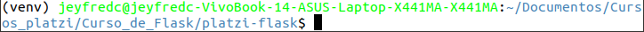

para salir del ambiente virtual ejecutar en la terminal

```
deactivate
```

y dejara de aparece el (venv)

- Dentro de nuestro ambiente virtual en el caso de los que posean debian, ubuntu o derivados ejecutar

```
pip3 install flask
```
o

```
pip install flask
```

- con el siguiente comando podemos ver las dependencias que estan instaladas en el ambiente virtual

```
pip3 freeze
```

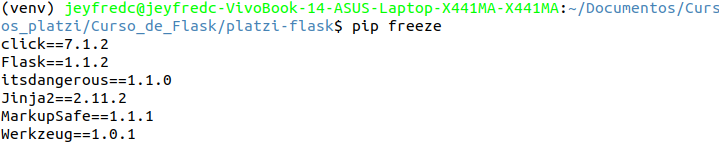

- En la carpeta de **platzi-flask** crear un archivo llamado **requirements.txt**, este archivo, lo utiliza pip para instalar dependencias, dentro de este archivo escribir la palabra **flask** y guardar

- en la terminal ejecutar el siguiente comando

```
pip3 install -r requirements.txt
```

**Este comando es el que se va a ejecutar cuando se requiera instalar una nueva dependencia o extension**

- Crear en la carpeta **platzi-flask** otro archivo llamado **main.py**

- En el archivo **main.py** colocar el siguiente codigo

```
from flask import Flask


app = Flask(__name__)


@app.route('/')
def hello():
    return 'Hello World Flask'
```

- Lo que se debe hacer a continuacion es prender un nuevo servidor con el siguiente comando en la terminal, se debe indicar que es lo que se va a correr en el servidor el cual es el nombre del archivo

```
export FLASK_APP=main.py
```

- Para verificar que existe ejecutar este comando en la terminal

```
echo $FLASK_APP
```

y debe aparece **main.py** en la terminal

- Luego ejecutar el siguiente comando en la terminal

```
flask run
```

seguido de esto va aparecer un mensaje como este 

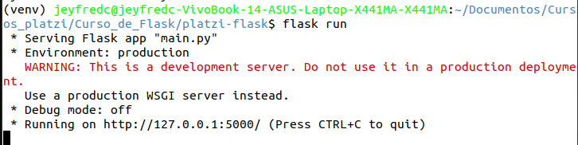

posterior a esto, se puede copiar la ruta que aparezca **http://127.0.0.1:5000/** en google Chrome o el navegador que se este usando o **localhost:5000** y ya debe aparecer el mensaje de la funcion hello establecida en el archivo **main.py**

## Clase 6 Debugging en Flask

Debugging: es el proceso de identificar y corregir errores de programación. Ademas de esto lo que hace es identificar los cambios que podamos hacer en nuestro archivo y lo va a reflejar inmediatamente

**Por ejemplo**

si modifico en la funcion **hello** el mensaje del return por otro mensaje, no se va a ver reflejado hasta que no apague el servidor y vuelva a prenderlo. si lo dejo vacio igualmente se tiene que apagar el servidor, volver a prender y despues de esto va a salir un mensaje de error el cual dice **Internal Server Error**.

Al implementar o activar el debug mode va a permitir que cualquier cambio que haga lo identifique el servidor sin tener que apagar y prender el servidor y adicional va a identificar errores en el caso que los llegue a tener

Para activar el debug mode, se debe apagar el servidor con **Ctrl + C**y asi como anteriormente se escribio **export FLASK_APP=main.py** escribir lo siguiente en la consola:

```
export FLASK_DEBUG=1
```

- Para verificar que existe ejecutar este comando en la terminal

```
echo $FLASK_DEBUG
```

y nuevamente prender el servidor con 

```
flask run
```

Despues de realizar esto se puede modificar el mensaje de la funcion **hello** en el archivo **main.py** y la actualizacion se realizara al recargar la pagina

## Clase 7 Request y Response

El ciclo normal para obtener una respuesta es que, nuestro computador a traves del navegador hace una peticion al servidor y este envia una repuesta devuelta al navegador

Lo que se va a ver es como Flask utiliza los Request y los Responses para poder regresar la informacion que necesitamos

Lo primero que se hace es obtener la Ip del usuario que en ese momento esta ingresando a nuestra aplicacion, en este caso como el servidor es local, siempre es la misma y va a ser **127.0.0.1**

Flask provee varios tipos de contextos o variables donde se puede obtener contexto de la aplicacion, el primero que se va a trabajar es con request, entonces a continuacion en el codigo que se ha venido trabajando ingresar o modificar lo siguiente en el archivo **main.py**

```
from flask import Flask, request

app = Flask(__name__)


@app.route('/')
def hello():

    user_ip = request.remote_addr
    return f'Hello World, tu ip es {user_ip}'
```

guardar los cambios y nuevamente recargar el navegador, al actualizar debe salir la informacion que esta indicando en la funcion **hello**

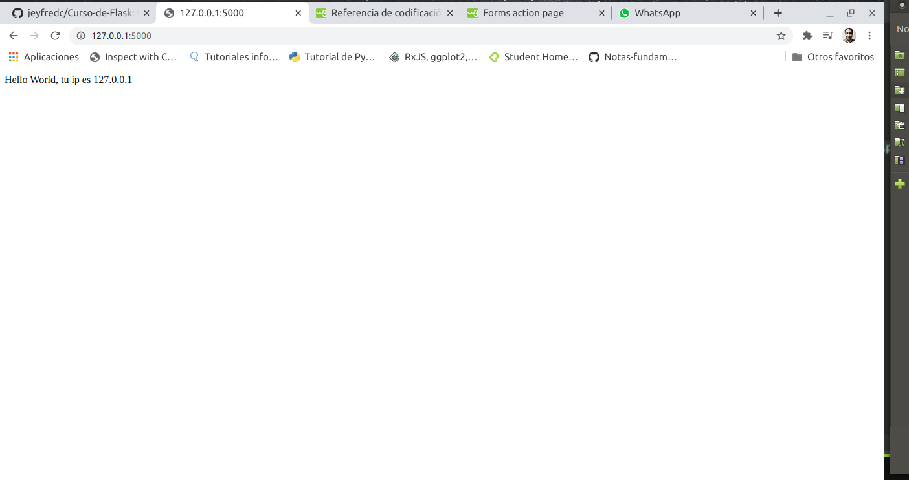

## Clase 8 Ciclos de Request y Response

**Request-Response:** es uno de los métodos básicos que usan las computadoras para comunicarse entre sí, en el que la primera computadora envía una solicitud de algunos datos y la segunda responde a la solicitud.

Por lo general, hay una serie de intercambios de este tipo hasta que se envía el mensaje completo.

**Por ejemplo:** navegar por una página web es un ejemplo de comunicación de request-response.

Request-response se puede ver como una llamada telefónica, en la que se llama a alguien y responde a la llamada; es decir hacemos una petición y recibimos una respuesta.

en esta clase se va a modificar el archivo pero para entender lo que se esta realizando es importante entender un poco de lo que hacen las cookies. en este video https://www.youtube.com/watch?v=QFrUTDfYgnM&ab_channel=MarketingDigitalyRedesSociales se explica como funcionan y a continuacion el codigo que se va a modificar en **main.py**

```
from flask import Flask, request, make_response,redirect

app = Flask(__name__)

@app.route('/')
def index():
    user_ip = request.remote_addr

    response = make_response(redirect('/hello'))

    response.set_cookie('user_ip', user_ip)

    return response

@app.route('/hello')
def hello():
    user_ip = request.cookies.get('user_ip')
    return f'Hello World, tu ip es {user_ip}'
```

la modificacion que se hizo fue crear la ruta raiz, la cual anteriormente la tenia directamente la funcion **hello** ahora lo que se esta haciendo es crear una nueva ruta que se va a guardar en una cookie y despues rediri al usuario a la ruta **hello**

En la consola vemos que el servidor primero obtiene la ruta raiz la cual regresa un codigo 302 que es el de redireccion y despues lo manda a la ruta hello donde regresa un codigo 200 (El código de respuesta 200, ok, es un código de respuesta del servidor HTTP que nos ofrecerá el estatus ante una petición estandar correcta a la que puede responder sin problemas)

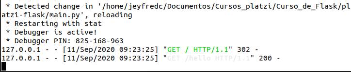

y en el navegador la ruta **hello** es la que se va a ver reflejada 

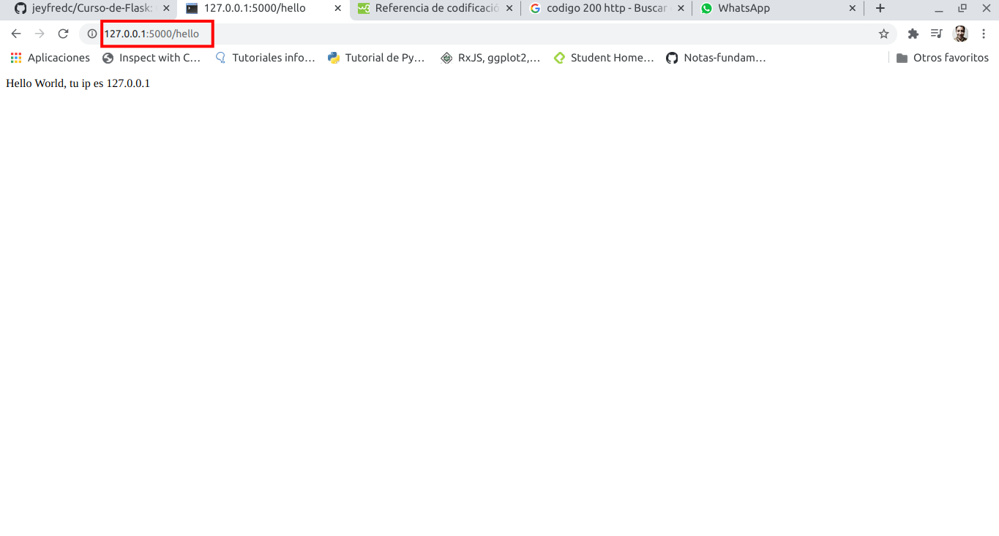

## Clase 9 Templates con Jinja 2

Un template es un archivo HTML que permite renderear informacion estatica y dinamica

Flask esta configurado para que busque por defecto en un directorio llamado templates el archivo que se le quiere pasar, lo que se va a hacer a continuacion es crear una carpeta dentro de **platzi-flask** una carpeta llamada **templates** y dentro de este se van a guardar todos los templates, dentro de este crear un archivo llamado **hello.html**

A continuacion en el archivo **main.py** importar **render_template** y en el return de la funcion **hello** pasar el siguiente codigo **render_template('hello.html', user_ip=user_ip)** lo que esta haciendo es recoocer el archivo html que se creo y pasando la variable user_ip la cual tambien se va a pasar en el html

el archivo **main.py** queda asi 

```
from flask import Flask, request, make_response,redirect, render_template

app = Flask(__name__)

@app.route('/')
def index():
    user_ip = request.remote_addr

    response = make_response(redirect('/hello'))

    response.set_cookie('user_ip', user_ip)

    return response

@app.route('/hello')
def hello():
    user_ip = request.cookies.get('user_ip')
    return render_template('hello.html', user_ip=user_ip)
```

el archivo **hello.html** solo contiene un h1 donde se pasa el mismo mensaje que se habia venido trabajando y la manera para que reconozca la variable de python es con el doble corchete {{}}

```
<h1>Hello World Platzi, tu Ip es {{ user_ip }}</h1>
```

luego al recargar la pagina, se obtendra el mismo mensaje pero dentro de una etiqueta h1

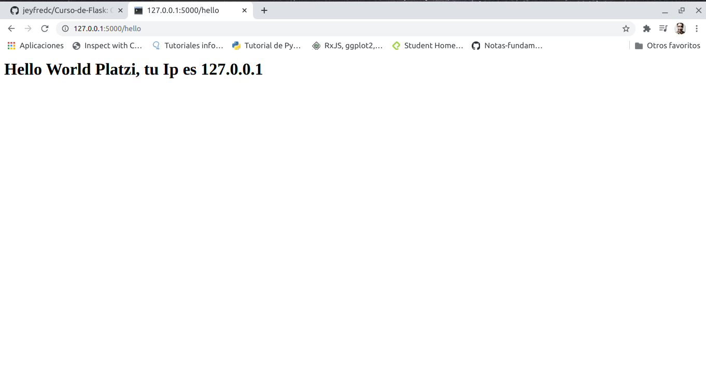

## Clase 10 Estructuras de control

**Iteración:** es la repetición de un segmento de código dentro de un programa de computadora. Puede usarse tanto como un término genérico (como sinónimo de repetición), así como para describir una forma específica de repetición con un estado mutable.

Un ejemplo de iteración sería el siguiente:

```

        <tr>
                <td>{{ key }}td>
                <td>{{ segment }}td>
        tr>
  

```

En este ejemplo estamos iterando por cada segment_details.items() para mostrar los campos en una tabla `{{ key }}` `{{ segment }}` de esta forma dependiendo de cuantos segment_details.items() haya se repetirá el código.

En esta clase se van a modificar los archivos **main.py** el cual queda con la siguiente estructura

```
from flask import Flask, request, make_response,redirect, render_template

app = Flask(__name__)

todos = ['TODO 1', 'TODO 2', 'TODO 3']

@app.route('/')
def index():
    user_ip = request.remote_addr

    response = make_response(redirect('/hello'))

    response.set_cookie('user_ip', user_ip)

    return response

@app.route('/hello')
def hello():
    user_ip = request.cookies.get('user_ip')
    context ={
        'user_ip': user_ip,
        'todos': todos,
    }
    return render_template('hello.html', **context)
```

En el archivo **main.py** , se creo una lista que guarda varios valores `todos = ['TODO 1', 'TODO 2', 'TODO 3']`.

Dentro de la funcion **hello** se crea un diccionario llamado context donde se pasa la ip del usuario y la variable todos, al crear el diccionario y pasarlo por return con un doble **, lo que se esta haciendo es expandir todas las variables que contiene el diccionario

Ahora se modifica el archivo **hello.html**, el cual queda con la siguiente estructura

```


<h1>Hello World Platzi, tu Ip es {{ user_ip }}</h1>


    <a href="{{ url_for('index') }}">Ir a inicio</a>


<ul>
    
    <li>{{todo}}</li>
    
</ul>
```

como se indica para poder utiliar python dentro de html la condicion if debe ir entre 

```
Inicia


Finaliza con 

```

para utilizar un for 

```
Inicia

Imprime
{{variable}}
Finaliza con

```

para ver como funciona en el navegador

se abre el navegador y luego con click derecho dar click en inspeccionar o con **Ctrl + Shift + i**

y se va a abrir la consola de DeepTools

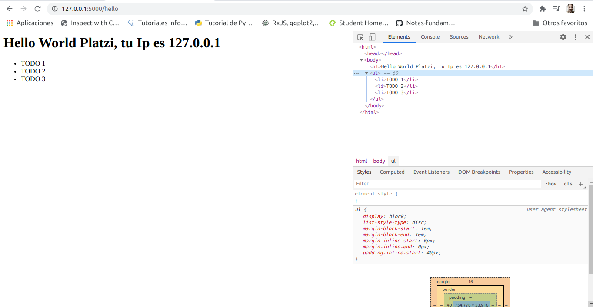

dar click en la pestaña **>>** y luego seleccionar **aplication**

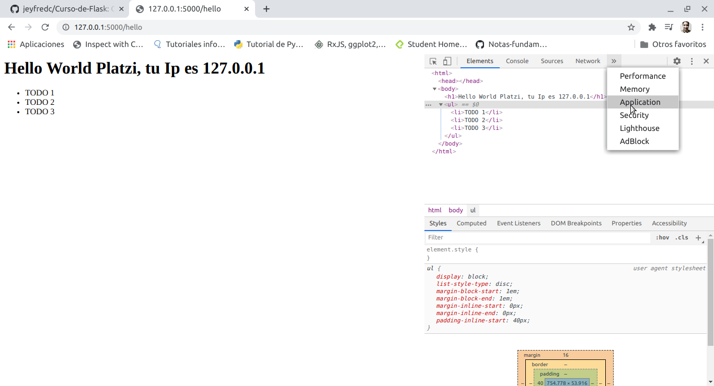

Seleccionar cookies y luego dar click en la ip, en el costado derecho va a aparecer el listado de cookies, seleccionar **clear all** y luego recargar la pagina

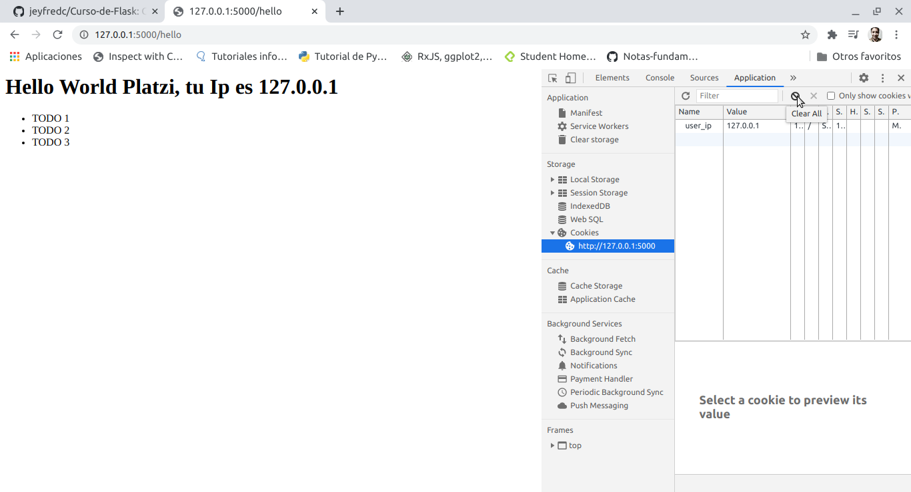

luego va a aparecer el enlace creado **ir a inicio** y al dar click hay aparecera nuevamente el navegador con las cookies

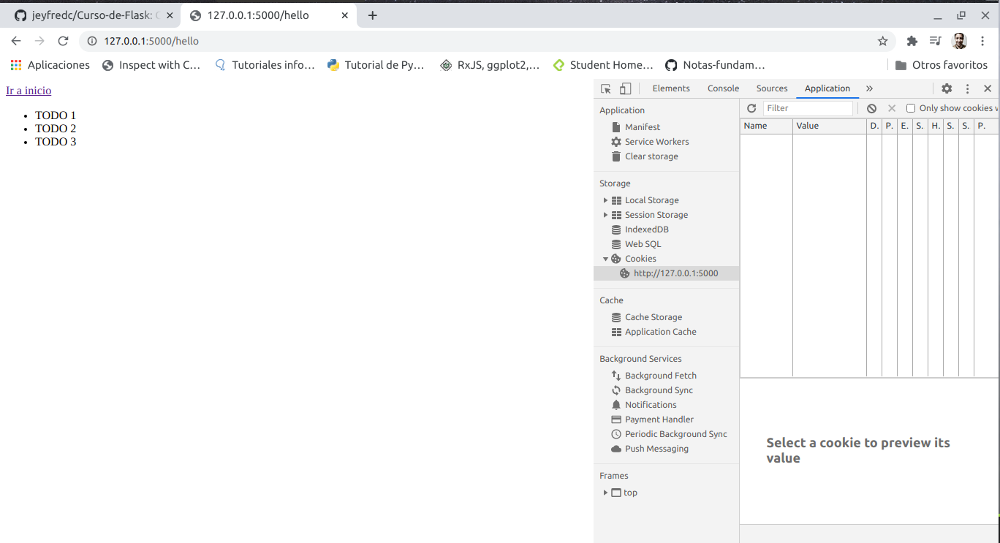

## Clase 11 Herencia de templates

El uso de templates es una funcionalidad muy util donde podemos tener un template base, en el cual podemos tener un esqueleto de html de la aplicacion y se puede extender a otros templates como el de **hello.html**, lo que significa que es mas util y re-utilizable.

Lo primero que se hace es crear el archivo html base en la carpeta de templates, al archivo se le llamara **base.html**

```
<!DOCTYPE html>
<html lang="en">
<head>
    <meta charset="UTF-8">
    <meta name="viewport" content="width=device-width, initial-scale=1.0">
    <title>Document</title>
</head>
<body>
    
</body>
</html>
```

y en el template **hello.html** colocar la estructura de codigo

```

```


Posterior a esto se empiezan a modificar ambos archivos y quedan de la siguiente forma

**base.html**

```
<!DOCTYPE html>
<html lang="en">
<head>
    <meta charset="UTF-8">
    <meta name="viewport" content="width=device-width, initial-scale=1.0">
    <title>
         Flask Platzi | 
    </title>
</head>
<body>
    
    
</body>
</html>
```

**hello.html**

```



    {{ super() }}
    Bienvenido




    

        <h1>Hello World Platzi, tu Ip es {{ user_ip }}</h1>

    
        <a href="{{ url_for('index') }}">Ir a inicio</a>
    

    <ul>
        
    <li>{{todo}}</li>
        
    </ul>

```

Ambos codigos tienen relacion, en el html se debe especificar el contenido que va a llevar, por eso razon todo se encierra entre bloques de ``, lo que hace super es heredar del template base y mezcla Flask Platzi | Bienvenido, en relacion a los dos codigos y se ve de la siguiente forma

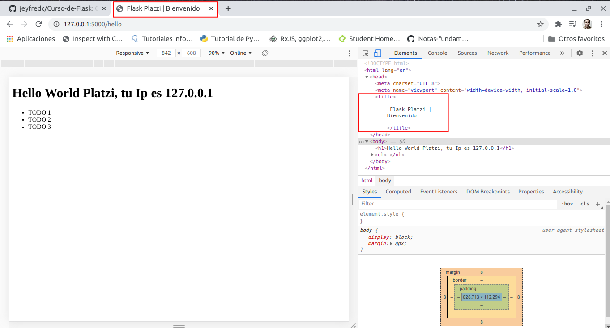

ahora en la variable `todos` en el archivo **main.py** cambiar `todos = ['TODO 1', 'TODO 2', 'TODO 3']` por `todos = ['Comprar cafe', 'Enviar solicitud de compra', 'Entregar video a productor']`

**Macro:** son un conjunto de comandos que se invocan con una palabra clave, opcionalmente seguidas de parámetros que se utilizan como código literal. Los Macros son manejados por el compilador y no por el ejecutable compilado.

Los macros facilitan la actualización y mantenimiento de las aplicaciones debido a que su re-utilización minimiza la cantidad de código escrito necesario para escribir un programa.

En este ejemplo nuestra macro se vería de la siguiente manera:

```

    
        <li class="active"><a href="{{ url_for(endpoint) }}">{{text}}</a></li>
    
        <li><a href="{{ url_for(endpoint) }}">{{text}}</a></li>
    

```
Un ejemplo de uso de macros en Flask:
```

<!DOCTYPE html>
<html lang="en">
    <head>
    
        <title>My application</title>
    
    </head>
    <body>
        <ul class="nav-list">
            {{ nav_link('home', 'Home') }}
            {{ nav_link('about', 'About') }}
            {{ nav_link('contact', 'Get in touch') }}
        </ul>
    
    
    </body>
</html>
```

Como podemos observar en la primera línea estamos llamando a macros.html que contiene todos nuestros macros, pero queremos uno en específico así que escribimos import nav_link para traer el macro deseado y lo renderizamos de esta manera en nuestro menú {{ nav_link('home', 'Home') }}.

ahora posteriormente dentro la carpeta **templates** se crea otro archivo llamado **macros.html** el cual lleva la siguiente estructura de codigo

```

    <li>Descripción: {{todo}}</li>

```

y se hace otra modificacion en **hello.html** donde se importa la macro en la lista quedando de la siguiente forma

```




    {{ super() }}
    Bienvenido




    

        <h1>Hello World Platzi, tu Ip es {{ user_ip }}</h1>

    
        <a href="{{ url_for('index') }}">Ir a inicio</a>
    

    <ul>
        
            {{macros.render_todo(todo)}}
        
    </ul>

```

## Clase 12 Include y links

En esta clase  se crea una barra de navegacion que lleven a inicio y a platzi utilizando el keyword **include**, crear en la carpeta **templates** un nuevo archivo el cual se va a llamar **navbar.html**, que llevara la siguiente estructura de codigo

```
<nav>
    <ul>
        <li><a href="{{ url_for('index')}}">Ir a inicio</a></li>
        <li><a href="https://platzi.com" target="_blank">Ir a Platzi</a></li>
    </ul>
</nav>
```

Nuevamente se cambiar el archivo **base.html** donde se crea un header y se le añade el contenido, queda de la siguiente forma

```
<!DOCTYPE html>
<html lang="en">
<head>
    <meta charset="UTF-8">
    <meta name="viewport" content="width=device-width, initial-scale=1.0">
    <title>
         Flask Platzi | 
    </title>
</head>
<body>
    <header>
        
    </header>
    
    
</body>
</html>
```

Al recargar la pagina lo que se tiene que ver es lo siguiente

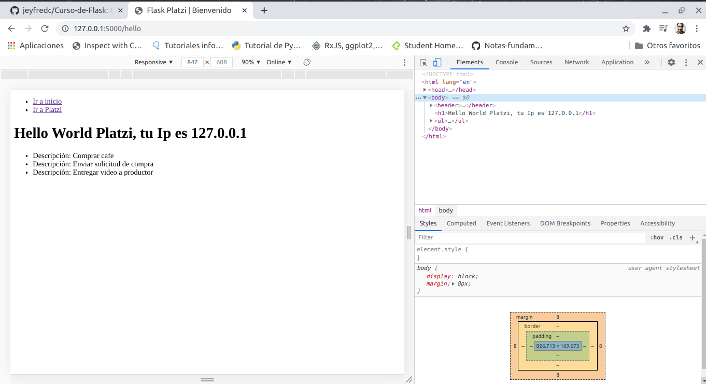

## Clase 13 Uso de archivos estáticos: imágenes

En la carpeta **platzi-flask** crear una nueva carpeta que se llame **static** donde se van a crear archivos estaticos como imagenes o archivos de estilos css, la manera en la que Flask maneja los archivos es similar a la de los templates.

Dentro de la carpeta **static** crear una subcarpeta que se llame **images** y descargar la imagen de platzi


en el archivo **navbar.html** modificar y agregar lo siguiente

```
<nav>
    <ul>
        
        <li><a href="{{ url_for('index')}}">Ir a inicio</a></li>
        <li><a href="https://platzi.com" target="_blank">Ir a Platzi</a></li>
    </ul>
</nav>
```

Despues, recargar la pagina y debe salir con la imagen descargada, en caso que salga otra imagen significa que quedo cacheada en el navegador, para poder cargarla bien ejecutar `Ctrl + Shift + r`

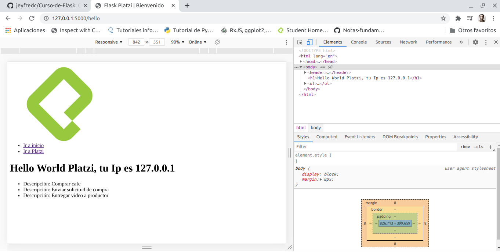

El tamaño de la imagen es un poco grande por lo que se tiene que modificar para eso dentro de la carpeta **static** se debe crear otra subcarpeta que se va a llamar **css** y dentro de esta crear un archivo llamado **main.css** y modificar la imagen con la siguiente instruccion

```
img{
    max-width: 30px;
}
```

y luego referenciarlo en el archivo **base.html**, queda asi 

```
<!DOCTYPE html>
<html lang="en">
<head>
    <meta charset="UTF-8">
    <meta name="viewport" content="width=device-width, initial-scale=1.0">
    <title>
         Flask Platzi | 
    </title>
    <link rel="stylesheet" href="{{ url_for('static', filename = 'css/main.css')}}">
</head>
<body>
    <header>
        
    </header>
    
    
</body>
</html>
```

se recarga la pagina y la imagen del logo ya debe salir mas pequeña

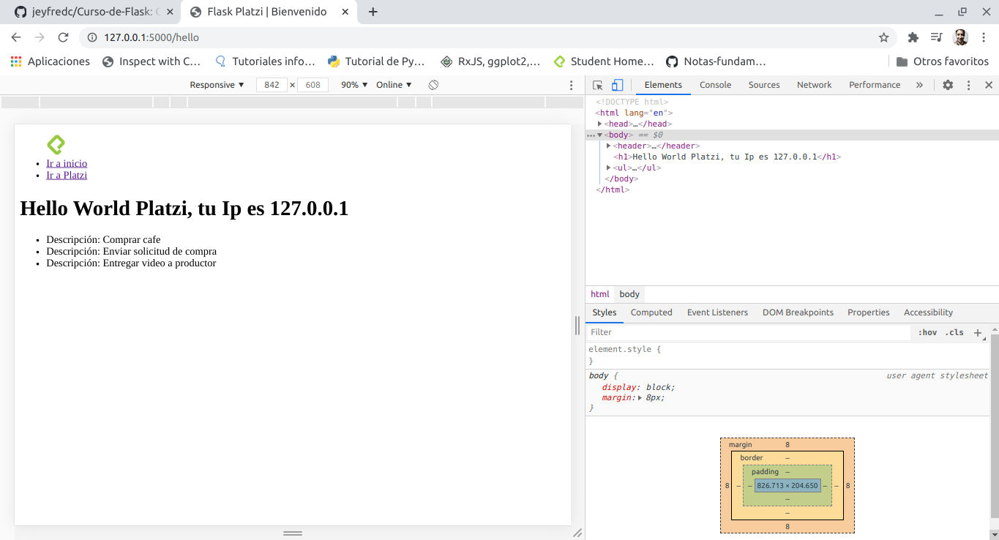

por ultimo se cambia la letra en el archivo **main.css** por un san-serif en el html

```
html * {
    font-family: sans-serif;
}

img{
    max-width: 30px;
}
```

## Clase 14 Configurar páginas de error

**Códigos de error:**

**100:** no son errores sino mensajes informativos. Como usuario nunca los verás, sino que entre bambalinas indica que la petición se ha recibido y se continúa el proceso.

**200:** estos códigos también indican que todo ha ido correctamente. La petición se ha recibido, se ha procesado y se ha devuelto satisfactoriamente. Por tanto, nunca los verás en tu navegador, pues significan que todo ha ido bien.

**300:** están relacionados con redirecciones. Los servidores usan estos códigos para indicar al navegador que la página o recurso que han pedido se ha movido de sitio. Como usuario, no verás estos códigos, aunque gracias a ellos una página te podría redirigir automáticamente a otra.

**400:** corresponden a errores del cliente y con frecuencia sí los verás. Es el caso del conocido error 404, que aparece cuando la página que has intentado buscar no existe. Es, por tanto, un error del cliente (la dirección web estaba mal).

**500:** mientras que los códigos de estado 400 implican errores por parte del cliente (es decir, de parte tuya, tu navegador o tu conexión), los errores 500 son errores desde la parte del servidor. Es posible que el servidor tenga algún problema temporal y no hay mucho que puedas hacer salvo probar de nuevo más tarde.

Para esta clase se va manejar el error(404).

En el archivo **main.py** se va agregar la ruta al error 404 de la siguiente forma agregando **errorhandler** donde se hace la ruta hacia **404.html** y el archivo tambien se debe crear en la carpeta de **templates**

```
from flask import Flask, request, make_response,redirect, render_template

app = Flask(__name__)

todos = ['Comprar cafe', 'Enviar solicitud de compra', 'Entregar video a productor']

@app.errorhandler(404)
def not_found(error):
    return render_template('404.html', error=error)

@app.route('/')
def index():
    user_ip = request.remote_addr

    response = make_response(redirect('/hello'))

    response.set_cookie('user_ip', user_ip)

    return response

@app.route('/hello')
def hello():
    user_ip = request.cookies.get('user_ip')
    context ={
        'user_ip': user_ip,
        'todos': todos,
    }
    return render_template('hello.html', **context)
```

en el archivo **404.html** agregar el siguiente contenido

```



{{ super() }}
    404



    <h1>Lo sentimos no encontramos lo que buscabas</h1>
    <p> {{error}} </p>

```
Al cargar la pagina como error aparecera lo siguiente

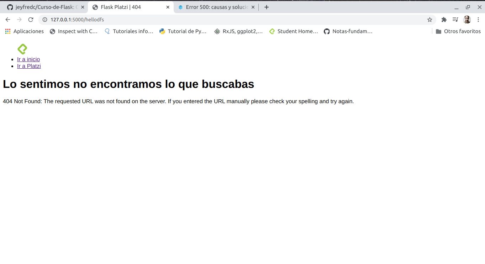

como reto del curso queda crear los archivos necesarios para dar manejo al error(500)

## Clase 15 Flask Bootstrap

para esta clase se va a usar un Framework llamado **Bootstrap** el cual fue creado por twitter, este framework implementa html, css y JavaScript y se va a usar para mejorar el diseño de la pagina que se tiene actualmente

**Framework:** es un conjunto estandarizado de conceptos, prácticas y criterios para enfocar un tipo de problemática particular que sirve como referencia, para enfrentar y resolver nuevos problemas de índole similar.

para instalar Bootstrap en Flask lo que se debe hacer es ir al archivo **requirements.txt** y agregar en la siguiente linea de flask `flask-bootstrap` y despues en la terminal ejecutar 

```
pip install -r requirements.txt
```

Despues que aparezca en la consola que ya quedo instalado Bootstrap

A continuacion lo que se debe hacer es inicializar Bootstrap en el archivo **main.py** y el archivo queda modificado asi

```
from flask import Flask, request, make_response,redirect, render_template
from flask_bootstrap import Bootstrap

app = Flask(__name__)
bootstrap = Bootstrap(app)

todos = ['Comprar cafe', 'Enviar solicitud de compra', 'Entregar video a productor']

@app.errorhandler(404)
def not_found(error):
    return render_template('404.html', error=error)


@app.errorhandler(500)
def internal_server_error(error):
    return render_template('500.html', error=error)


@app.route('/')
def index():
    user_ip = request.remote_addr

    response = make_response(redirect('/hello'))

    response.set_cookie('user_ip', user_ip)

    return response

@app.route('/hello')
def hello():
    user_ip = request.cookies.get('user_ip')
    context ={
        'user_ip': user_ip,
        'todos': todos,
    }
    return render_template('hello.html', **context)
```

Bootstrap tambien tiene un archivoi llamado **base.html**, por tanto lo que se va a hacer es en el archivo **base.html** que se ha venido creando se va a modificar y a heredar del archivo de Bootstrap, con la modificacion el archivo queda de la siguiente forma

```



    {{ super() }}

    <title>
        Flask PLatzi | 
    </title>
    <link rel="stylesheet" href="{{ url_for('static', filename='css/main.css')}}">




    
        
    
    
    


```

y en el archivo de **navbar.html** se modifica y agrega una barra de menu utilizando Bootstrap 3.3, el archivo queda con el siguiente codigo 

```
<!-- <nav>
    <ul>
        
        <li><a href="{{ url_for('index')}}">Ir a inicio</a></li>
        <li><a href="https://platzi.com" target="_blank">Ir a Platzi</a></li>
    </ul>
</nav> -->

<div class="navbar navbar-inverse" role="navigation">
    <div class="container">
        <div class="navbar-header">
            <button type="button"
                    class="navbar-toggle"
                    data-toggle="collapse"
                    data-target=".navbar-collapse">
                <span class="sr-only">Toggle navigation</span>
                <span class="icon-bar"></span>
                <span class="icon-bar"></span>
                <span class="icon-bar"></span>
            </button>
            <a class="navbar-brand" href="{{ url_for('index') }}">
                
            </a>
        </div>

        <div class="navbar-collapse collapse">
            <ul class="nav navbar-nav">
                <li><a href="{{ url_for('index') }}">Inicio</a></li>
                <li><a href="https://platzi.com" target="_blank">Platzi</a></li>
            </ul>
        </div>
    </div>
</div>

```

Finalmente al guardar y recargar la pagina se debe mostrar de la siguiente forma

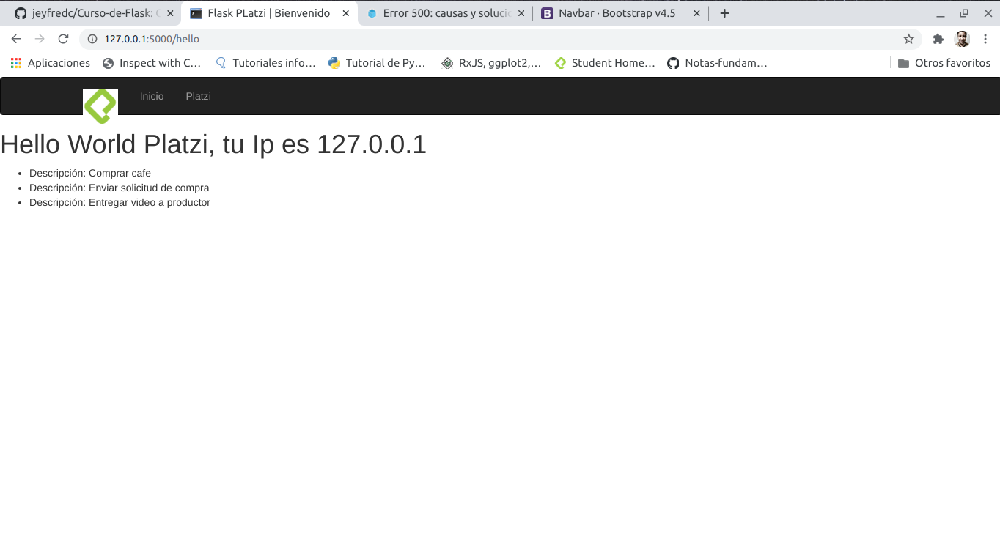

## Clase 16 Configuración de Flask

En esta clase se va a cambiar el ambiente de produccion que por defecto viene configurado al activar el servidor, cuando esta activado el ambiente de produccion cualquier persona puede ver el codigo y lo que esta sucediendo por detras de la aplicacion, es por eso que es recomendable usar el development mode.

Para activar el development mode debes escribir lo siguiente en la consola:

```
export FLASK_APP=main.py
echo $FLASK_APP
export FLASK_DEBUG=1
echo FLASK_DEBUG
export FLASK_ENV=development
echo $FLASK_ENV
```

Si se requiere tambien se puede activar el modo debug y posteriormente prender el servidor

```
flask run
```

De esta manera el ambiente de produccion queda en modo Development

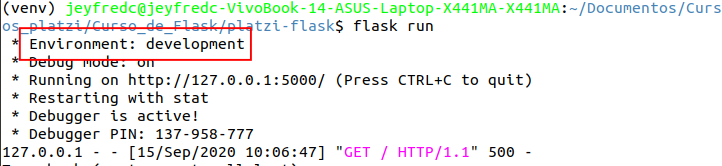

y ya no aparece el **warning** que antes salia 


Se ha venido utilzando el objeto request en el archivo **main.py** el cual nos da informacion sobre la peticion que hizo el usuario, pero Flask tambien tiene un objeto que se llama **SESSION**, este se utiliza para guardar informacion a traves de varias peticiones informacion del usuario de manera segura, actualmente guardamos la ip del usuario a traves de una cookie en el buscador, en el siguiente ejemplo se puede ver la ip del usuario y con la cookie pueden encontrar informacion del usuario en la cual puede tener informacion delicada, lo que hace Flask con **SESSION** es encriptar la informacion con una llave secreta y en este caso la unica persona que puede acceder a la informacion es quien tenga la llave secreta

**SESSION:** es un intercambio de información interactiva semipermanente, también conocido como diálogo, una conversación o un encuentro, entre dos o más dispositivos de comunicación, o entre un ordenador y usuario.

A continuacion un ejemplo de una modificacion de ip que no se deberia poder hacer 

anteriormente se podria ver esta imagen 


si accedemos a traves del tag de **application** a traves del modo DevTools del navegador podemos cambiar la ip por cualquier cosa como por ejemplo un **Hola**

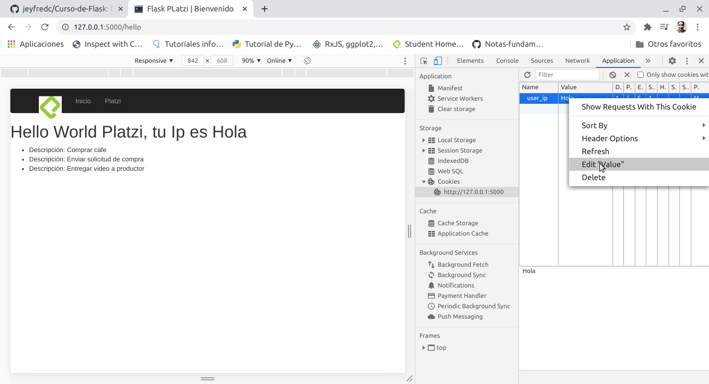

ahora se va a implementar una **SESSION** en Flask

Para crear una llave secreta en el archivo **main.py** añadir la siguiente modificacion, donde se importa **session**, se establece una `app.config['SECRET_KEY'] = 'SUPER SECRETO'` donde se asigna la clave, esto por ejemplo se utiliza pero no es recomendable usarlo de esta forma, en la parte donde se obtenian las cookies se hace cambio de `request` por `session`

```
from flask import Flask, request, make_response,redirect, render_template, session
from flask_bootstrap import Bootstrap

app = Flask(__name__)
bootstrap = Bootstrap(app)

app.config['SECRET_KEY'] = 'SUPER SECRETO'

todos = ['Comprar cafe', 'Enviar solicitud de compra', 'Entregar video a productor']

@app.errorhandler(404)
def not_found(error):
    return render_template('404.html', error=error)


@app.errorhandler(500)
def internal_server_error(error):
    return render_template('500.html', error=error)


@app.route('/')
def index():
    user_ip = request.remote_addr

    response = make_response(redirect('/hello'))

    session['user_ip'] = user_ip

    return response

@app.route('/hello')
def hello():
    user_ip = session.get('user_ip')
    context ={
        'user_ip': user_ip,
        'todos': todos,
    }
    return render_template('hello.html', **context)
```

De esta manera al borrar las cookies del navegador y volver a recargar la pagina podemos ver que la informacion cambia en la cookie tambien

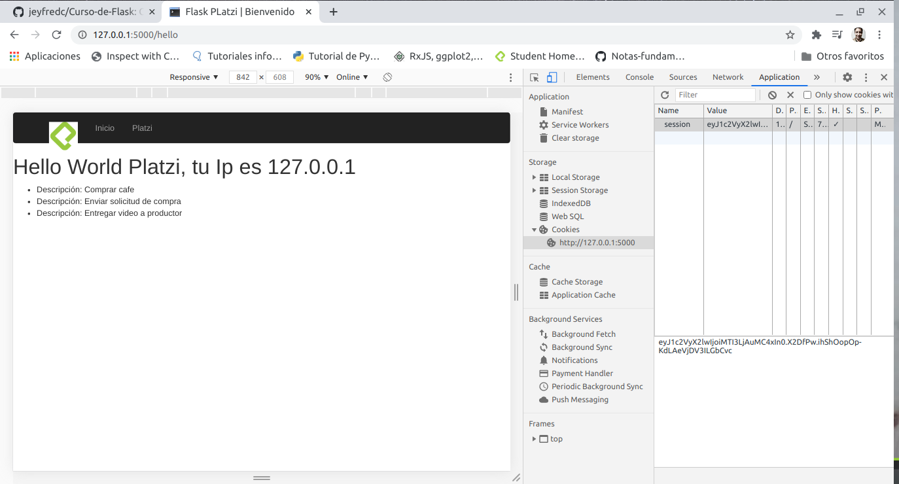

tambien existen otros 2 objetos los cuales son **current_app** que da informacion sobre la aplicacion que corre en el momento y la variable g que al hacer un nuevo request se va a borrar 

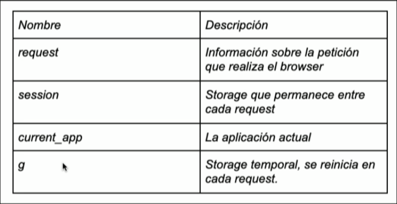

## Clase 17 Implementación de Flask-Bootstrap y Flask-WTF

En esta clase vamos a aprender como impĺementar formas o como renderear y obtener input del usuario a traves de formas. Las aplicaciones web, reciben informacion que ingresa el usuario a traves de formularios o formas enviadas a traves de internet mediante un metodo **POST**, cuando el servidor recibe esta informacion, la procesa como por ejemplo un loggin de usuario o una peticion para crear una nueva cuenta en la base de datos. El servidor valida la informacion que viene en la forma y hace las acciones necesarias de la logica de negocio en nuestra aplicacion.

Flask cuenta con una extension llamada Flask-WTF(WHAT THE FORMS), la cual es una libreria de Python que ayuda a renderear y validar formas web y funciona con cualquier Framework de Python.

A continuacion lo que se va a hacer es instalar esta libreria en el archivo de **requirements.txt**

el cual queda con las siguiente lineas de codigo 

```
flask 
flask-bootstrap
flask-wtf
```

y ahora en la consola con el ambiente virtual encendido ejecutar 

```
pip install -r requirements.txt
```

a continuacion en el archivo **main.py** arriba del `@app.errorhandler(404)` crear la clase `loginForm`, para poder crearla se debe importar `from flask_wtf import FlaskForm`, adicional las formas tienen fields o tienen campos, en este caso son para el user_name y el user_password, los cuales en esta clase no se van a procesar pero se van a requerir mas adelante, para implementarlos se debe importar `from wtforms.fields import StringField, PasswordField`, para validar que el usuario envie los datos a traves de la forma con los datos requeridos se debe importar un validador de datos que tambien lo tiene **WTF** `` el codigo queda de la siguiente forma


```
from flask import Flask, request, make_response,redirect, render_template, session
from flask_bootstrap import Bootstrap
from flask_wtf import FlaskForm
from wtforms.fields import StringField, PasswordField
from wtforms.validators import DataRequired

app = Flask(__name__)
bootstrap = Bootstrap(app)

app.config['SECRET_KEY'] = 'SUPER SECRETO'

todos = ['Comprar cafe', 'Enviar solicitud de compra', 'Entregar video a productor']

class LoginForm(FlaskForm):
    username = StringField('Nombre de usuario', validators=[DataRequired()])
    password = PasswordField('Password', validators=[DataRequired()])
    submit = SubmitField('Enviar')


@app.errorhandler(404)
def not_found(error):
    return render_template('404.html', error=error)


@app.errorhandler(500)
def internal_server_error(error):
    return render_template('500.html', error=error)


@app.route('/')
def index():
    user_ip = request.remote_addr

    response = make_response(redirect('/hello'))

    session['user_ip'] = user_ip

    return response

@app.route('/hello')
def hello():
    user_ip = session.get('user_ip')
    context ={
        'user_ip': user_ip,
        'todos': todos,
    }
    return render_template('hello.html', **context)
```

Despues de colocar este codigo ahora lo que se puede hacer es importarla al archivo **hello.html**, para eso lo que se va a hacer es crear un div con clase container la cual viene de Bootsrap. El archivo modificado queda asi

```





    {{ super() }}
    Bienvenido




    

        <h1>Hello World Platzi, tu Ip es {{ user_ip }}</h1>

    
        <a href="{{ url_for('index') }}">Ir a inicio</a>
    

    <div class="container">
<!--         <form action="{{ url_for('hello')}}" method="POST">
            {{ login_form.username }}
            {{ login_form.username.label }}
        </form> -->
        {{ wtf.quick_form(login_form) }}
    </div>

    <ul>
        
            {{macros.render_todo(todo)}}
        
    </ul>

```

al recargar el navegador, la pantalla se debe ver de la siguiente forma

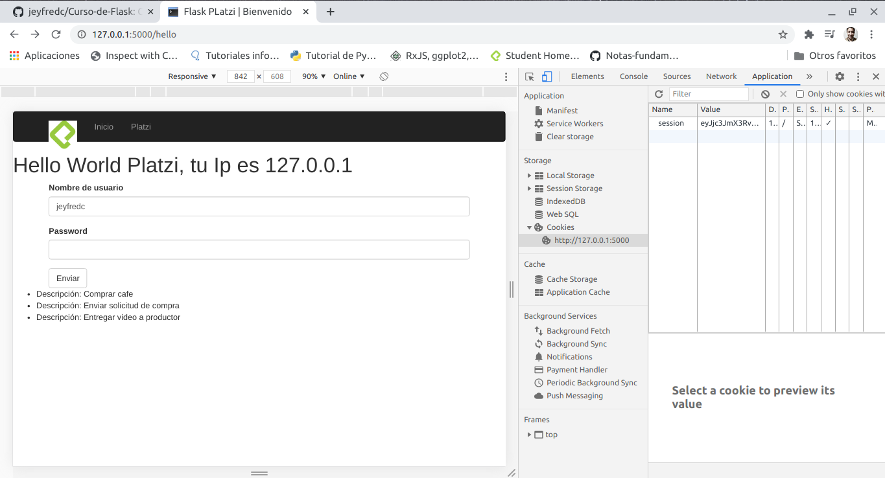

Al dar click en enviar, saldra un error, esto se soluciona en la siguiente clase

## Clase 18 Uso de método POST en Flask-WTF

Flask acepta peticiones **GET** por defecto y por ende no debemos declararla en nuestras rutas.

Pero cuando necesitamos hacer una petición **POST** al enviar un formulario debemos declararla de la siguiente manera, como en este ejemplo:

@app.route('/platzi-post', methods=['GET', 'POST'])
Debemos declararle además de la petición que queremos, **GET**, ya que le estamos pasando el parámetro methods para que acepte solo y únicamente las peticiones que estamos declarando.

De esta forma, al actualizar el navegador ya podremos hacer la petición **POST** a nuestra ruta deseada y obtener la respuesta requerida.

la modificacion en el archivo **main.py** es sobre la ruta **hello**, la cual queda asi 

```
@app.route('/hello', methods = ['GET', 'POST'])
```
al volver a dar click en enviar en la pagina, ya no nos va a dirigir a una pagina de error, si no que simplemente nos va a regresar


Ahora lo que se va a hacer es obtener y procesar los datos de la forma y agregar el `username` en la sesion se va a agregar un if statement donde se va a colocar `if login_form.validate_on_submit()` el cual es un metodo de Flask Form que lo que hace es detectar la ruta cuando se manda un **POST** y valida la forma, de esa forma la funcion se divide en 2, cuando se hace un **GET** regresa el template **hello** con la forma, pero si se  hace un **POST** y la forma es valida, regresa en este caso un redirect al index y se obtiene el username.

`username = login_form.username.data`, username es una instancia de un String Field pero se le debe indicar con data.

`session['username'] = username` este username se guarda en la **session** y se debe guardar como el **user_ip**

se debe importar **url_for** y agregar o hacer un redirect a index `return redirect(url_for('index'))`

el codigo  en el archivo **main.py** finalmente queda de esta forma

```
from flask import Flask, request, make_response,redirect, render_template, session, url_for
from flask_bootstrap import Bootstrap
from flask_wtf import FlaskForm
from wtforms.fields import StringField, PasswordField, SubmitField
from wtforms.validators import DataRequired

app = Flask(__name__)
bootstrap = Bootstrap(app)

app.config['SECRET_KEY'] = 'SUPER SECRETO'

todos = ['Comprar cafe', 'Enviar solicitud de compra', 'Entregar video a productor']

class LoginForm(FlaskForm):
    username = StringField('Nombre de usuario', validators=[DataRequired()])
    password = PasswordField('Password', validators=[DataRequired()])
    submit = SubmitField('Enviar')


@app.errorhandler(404)
def not_found(error):
    return render_template('404.html', error=error)


@app.errorhandler(500)
def internal_server_error(error):
    return render_template('500.html', error=error)


@app.route('/')
def index():
    user_ip = request.remote_addr

    response = make_response(redirect('/hello'))

    session['user_ip'] = user_ip

    return response

@app.route('/hello', methods = ['GET', 'POST'])
def hello():
    user_ip = session.get('user_ip')
    login_form = LoginForm()
    username = session.get('username')

    context ={
        'user_ip': user_ip,
        'todos': todos,
        'login_form': login_form,
        'username': username
    }

    if login_form.validate_on_submit():
        username = login_form.username.data
        session['username'] = username

        return redirect(url_for('index'))

    return render_template('hello.html', **context)
```

Posterior en el archivo **hello.html** se hacen unas modificaciones al codigo para poder reconocer al usuario o **username**

```





    {{ super() }}
    Bienvenido




    

        <h1>Bienvenido, {{ username | capitalize }}</h1> <!-- capitalize es para que la primer letra aparezca en mayuscula -->

    

    

        <h3>Tu Ip es {{ user_ip }}</h3>

    
        <a href="{{ url_for('index') }}">Ir a inicio</a>
    

    <div class="container">
<!--         <form action="{{ url_for('hello')}}" method="POST">
            {{ login_form.username }}
            {{ login_form.username.label }}
        </form> -->
        {{ wtf.quick_form(login_form) }}
    </div>

    <ul>
        
            {{macros.render_todo(todo)}}
        
    </ul>

```

Al recargar la pagina ya tendremos el index con el mensaje de Bienvenida + la Ip que se establecio desde un comienzo

Se deben borrar las cookies, colocar un username, un password, dar click en enviar y posteriormente el navegador arrojara algo similar a lo siguiente

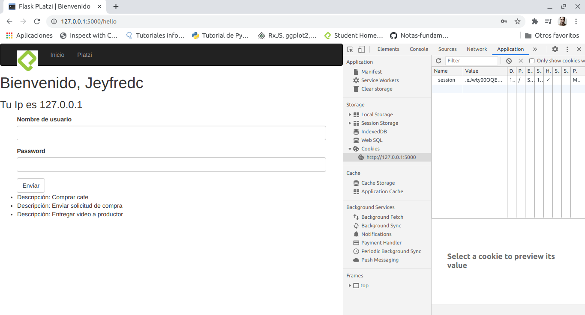

## Clase 19 Desplegar Flashes (mensajes emergentes)

En esta clase vamos aprender que es uyn flash o como mandar mensajes de informacion o de ayuda al usuario y en Flask un flash es un banner que va a aparecer abajo de la barra de navegacion en donde va indicar mensajes de exito, error o warning al usuario. En este caso lo que va a aparecer es un mensaje de exito despues de haber registrado el username y el password correctamente.

lo primero que se hace es importar flash `from flask import Flask, request, make_response,redirect, render_template, session, url_for, flash` en el archivo **main.py**

luego en el if statement `if login_form.validate_on_submit()` se agrega `flash('nombre de usuario registrado con éxito!')`, de esa manera Flask va a guardar en su memoria los flashes, los cuales hay que renderear en el html.

El codigo en **main.py** queda asi 

```
from flask import Flask, request, make_response,redirect, render_template, session, url_for, flash
from flask_bootstrap import Bootstrap
from flask_wtf import FlaskForm
from wtforms.fields import StringField, PasswordField, SubmitField
from wtforms.validators import DataRequired

app = Flask(__name__)
bootstrap = Bootstrap(app)

app.config['SECRET_KEY'] = 'SUPER SECRETO'

todos = ['Comprar cafe', 'Enviar solicitud de compra', 'Entregar video a productor']

class LoginForm(FlaskForm):
    username = StringField('Nombre de usuario', validators=[DataRequired()])
    password = PasswordField('Password', validators=[DataRequired()])
    submit = SubmitField('Enviar')


@app.errorhandler(404)
def not_found(error):
    return render_template('404.html', error=error)


@app.errorhandler(500)
def internal_server_error(error):
    return render_template('500.html', error=error)


@app.route('/')
def index():
    user_ip = request.remote_addr

    response = make_response(redirect('/hello'))

    session['user_ip'] = user_ip

    return response

@app.route('/hello', methods = ['GET', 'POST'])
def hello():
    user_ip = session.get('user_ip')
    login_form = LoginForm()
    username = session.get('username')

    context ={
        'user_ip': user_ip,
        'todos': todos,
        'login_form': login_form,
        'username': username
    }

    if login_form.validate_on_submit():
        username = login_form.username.data
        session['username'] = username
        flash('nombre de usuario registrado con éxito!')

        return redirect(url_for('index'))

    return render_template('hello.html', **context)
```

En **base.html** se agrega un For Loop, estos se colocan sobre la base porque lo que se quiere es que los flashes se rendereen en cualquier pagina y esto se coloca debajo del **navbar**

`` **get_flashed_messages()** es una funcion al igual que **url_for** que pone Flask a disposicion para los templates desde que se inicializa la aplicacion.

estas son las lineas de codigo que siguen, donde hay apertura y cierre del for 

```
    
        <div class="alert alert-success alert-dismissible">
            <button type="button" data-dismiss="alert" class="close">&times;</button>

            {{ message }}
        </div>
    
```

en el **div**, se agregan 3 clases de Bootstrap para poder renderear el mensaje, se agrega el **alert** el cual para bootstrap, un flash es un alert, el cual va a ser de tipo success es decir de exito y dismissible que es para poder quitar el mensaje. Luego dentro del Div se agrega un boton que es el que sirve para cerrar el mensaje de alerta, se agrega la propiedad `data-dismiss="alert"`, que viene de bootstrap y es la que va a buscar el JavaScript para poder cerrar la alerta o el flash y tambien se agrega la clase `class="close"`, Despues se agrega una X con esta sintaxis la cual convierte a un signo de multiplicacion `&times;`. Por ultimo dentro del div va el mensaje el cual indica **nombre de usuario registrado con éxito!**.

Por ultimo se agrega el JavaScript que lleva Bootstrap mediante un `blockscript` y heredar mediante `{{ super() }}` todo lo que tiene el template de base.html de Bootstrap, sin esta linea de codigo no se puede cerrar el mensaje o flash del usuario registrado con exito

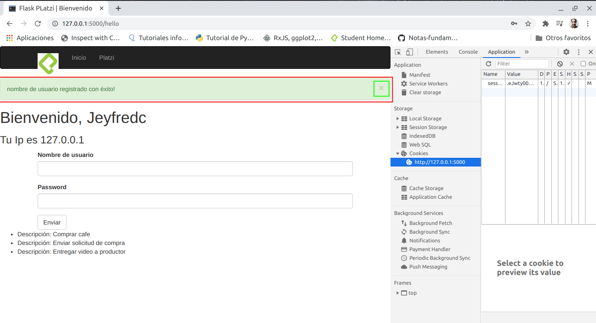

```
    
        {{ super() }}
    
```

Despues de importar el JavaScript se puede dar cierre al mensaje.

el archivo **base.html** queda asi

```



    {{ super() }}

    <title>
        Flask PLatzi | 
    </title>
    <link rel="stylesheet" href="{{ url_for('static', filename='css/main.css')}}">




    
        
    

    
        <div class="alert alert-success alert-dismissible">
            <button type="button" data-dismiss="alert" class="close">&times;</button>

            {{ message }}
        </div>
    
    
    

    
        {{ super() }}
    


```

## Clase 20 Pruebas básicas con Flask-testing

La etapa de pruebas se denomina testing y se trata de una investigación exhaustiva, no solo técnica sino también empírica, que busca reunir información objetiva sobre la calidad de un proyecto de software, por ejemplo, una aplicación móvil o un sitio web.

El objetivo del testing no solo es encontrar fallas sino también aumentar la confianza en la calidad del producto, facilitar información para la toma de decisiones y detectar oportunidades de mejora.

En esta clase vamos a aprender como hacer pruebas con Flask, probando el software, antes de llevarlo a produccion y que el usuario se encuentre con errores que no se deben encontrar, a veces cuando se integran nuevas funcionalidades se rompen otras cosas que antes funcionaban y las pruebas ayudan a detectar errores rapidamente y poder hacer las modificaciones necesarias.

Ahora lo que se va a hacer es instalar Flask Testing que permite acceder a variables y herramientas para poder realizar un testing sencillo, tamnbien se puede utilizar la libreria unittest de Python pero en este caso se quieren tener opciones para poder hacer testing directamente en Flask.

Nuevamente en el archivo **requirements.txt** agregar `flask-testing`, el archivo queda asi

```
flask 
flask-bootstrap
flask-wtf
flask-testing
```

ahora en la terminal ejecutar

```
pip install -r requirements.txt
```

ahora en **main.py** se va a crear un comando con el decorador `@app.cli.command()` , .cli significa ('comand line interface'), el comando que se va agregar es una funcion que se llama `def test():`, los test se van a utilizar con **unittest**, para lo cual se debe importar al principio del archivo con `import unittest` y en la funcion **test** se va a implementar la variable tests que va a hacer todo lo que encuentre unittest en un directorio que va a estar en la raiz que se va a llamar test `tests = unittest.TestLoader().discover('test')` despues lo que se hace es correr unittest con la sentencia `unittest.TextTestRunner().run(tests)`.

el archivo **main.py** queda asi 

```
from flask import Flask, request, make_response,redirect, render_template, session, url_for, flash
from flask_bootstrap import Bootstrap
from flask_wtf import FlaskForm
from wtforms.fields import StringField, PasswordField, SubmitField
from wtforms.validators import DataRequired
import unittest

app = Flask(__name__)
bootstrap = Bootstrap(app)

app.config['SECRET_KEY'] = 'SUPER SECRETO'

todos = ['Comprar cafe', 'Enviar solicitud de compra', 'Entregar video a productor']

class LoginForm(FlaskForm):
    username = StringField('Nombre de usuario', validators=[DataRequired()])
    password = PasswordField('Password', validators=[DataRequired()])
    submit = SubmitField('Enviar')


@app.cli.command()
def test():
    tests = unittest.TestLoader().discover('tests')
    unittest.TextTestRunner().run(tests)


@app.errorhandler(404)
def not_found(error):
    return render_template('404.html', error=error)


@app.errorhandler(500)
def internal_server_error(error):
    return render_template('500.html', error=error)


@app.route('/')
def index():
    user_ip = request.remote_addr

    response = make_response(redirect('/hello'))

    session['user_ip'] = user_ip

    return response

@app.route('/hello', methods = ['GET', 'POST'])
def hello():
    user_ip = session.get('user_ip')
    login_form = LoginForm()
    username = session.get('username')

    context ={
        'user_ip': user_ip,
        'todos': todos,
        'login_form': login_form,
        'username': username
    }

    if login_form.validate_on_submit():
        username = login_form.username.data
        session['username'] = username
        flash('nombre de usuario registrado con éxito!')

        return redirect(url_for('index'))

    return render_template('hello.html', **context)
```

Luego se crea un nuevo directorio o carpeta llamado **tests** en **platzi-flask**

En la terminal primero se debe exportar

```
export FLASK_APP=main.py
```

y luego correr 

```
flask test
```

debe aparecer Run Test 0 por lo que hasta el momento no se ha creado ningun test


Ahora lo que se debe hacer es escribir los test.

Para hacerlo, en la carpeta **tests**, se debe crear un archivo en el cual su nombre empiece por test y esta se va a llamar **test_base.py**, en este archivo se importa `from flask_testing import TestCase` TestCase va a ser una clase que vamos a extender al igual que **current_app y url_for** que se van a utilizar para verificar redireccion al index y que la aplicacion este corriendo

el archivo **test_base.py** queda asi con las explicaciones de cada test

```
from flask_testing import TestCase
from flask import current_app, url_for
#Se importa la aplicacion de Flask
from main import app

class MainTest(TestCase):
    # Se implementa el metodo create_app que vive en la clase TestCase y tiene que regresar una aplicacion de Flask
    def create_app(self):
        app.config['TESTING'] = True # Se configura la aplicacion para testing
        app.config['WTF_CSRF_ENABLED'] = False # Se indica que no se va a utilizar el CSRF( Cross-site request forgery o falsificación de petición en sitios cruzados) de las formas porque en este caso no existe una sesion activa del usuario
        
        return app

    # El primer Test es para probar que la app de Flask existe
    def test_app_exists(self):
        self.assertIsNotNone(current_app)

    # El segundo Test es para probar que la app se encuentra en modo Testing
    def test_app_in_test_mode(self):
        self.assertTrue(current_app.config['TESTING'])

    # El tercer Test es para probar que index redirige a hello
    def test_index_redirects(self):
        response = self.client.get(url_for('index'))

        self.assertRedirects(response, url_for('hello'))

    # El cuarto Test es para probar que al hacer un GET de hello el servidor esta enviando una respuesta 200 o una respuesta OK
    def test_hello_get(self):
        response = self.client.get(url_for('hello'))

        self.assert200(response)

    # El quinto Test es para probar que al hacer un POST de un usuario y password redirija al index con el mensaje de creado exitosamente
    def test_hello_post(self):
        fake_form = {
            'username': 'fake',
            'password': 'fake-password'
        }

        response = self.client.post(url_for('hello'), data = fake_form)

        self.assertRedirects(response, url_for('index'))
```

finalmente al correr nuevamente en el terminal `flask test` debe indicar que pasaron las 5 pruebas

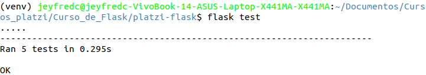

## Clase 21 Planteamiento del proyecto: To Do List

Crear una aplicacion mas en forma que haga algo util para los usuarios, esta consiste en crear una aplicacion para crear tareas o pendientes para el usuario, para hacerlo hay que colocar mas orden, modularizar la aplicacion en varios archivos para que sea mas facil mantenerla, aprendiendo que son los Blueprints, instalar una extension que se llama Flasklogin para poder hacer propiamente login con los usuarios, aprender sobre App Engine  que es la que servira para hacer deploy de la aplicacion y Google Data-store que va a ser la base de datos de la aplicacion

## Clase 22 App Factory

Lo primero que se va a hacer es organizar y configurar de una manera especial el proyecto para poderlo hacer de una manera especifica en Development y en Produccion.

El concepto de **App Factory** de Flask es una funcion que va a regresar la nueva app.

Se debe empezar cambiando la estructura de la aplicacion.

En la carpeta **platzi-flask** crear una subcarpeta que se llame **app**, en la cual se va a crear un nuevo paquete de python que se va a llamar **__init__.py** y dentro del archivo se va a crear la funcion `create app` que es la que nos va a regresar la nueva aplicacion y va a tener una configuracion parecida a **main.py**, pero va a estar modularizada. Se debe importar flask, bootstrap y el archivo config

```
from flask import flask
from flask_bootstrap import Bootstrap

from .config import Config

def create_app():
    app = Flask(__name__)
    bootstrap = Bootstrap(app)

    app.config.from_object(Config)

    return app
```

Dentro de la carpeta **app** crear el archivo **config.py**, el cual va a tener una clase que se llama `Config`, va a tener una propiedad que se va a llamar `SECRET_KEY = 'SUPER SECRET'` que es la que va a llevar la configuracion de la clave secreta

```
class Config:
    SECRET_KEY = 'SUPER SECRET'
```

Este archivo por el momento no debe contener nada mas 

Ahora como ya se establecio la configuracion en estos archivos en **main.py** tambien va a cambiar la configuracion de la aplicacion, por lo cual se va a importar desde app `create app`.

**main.py** queda asi

```
from flask import Flask, request, make_response,redirect, render_template, session, url_for, flash
from flask_bootstrap import Bootstrap
from flask_wtf import FlaskForm
from wtforms.fields import StringField, PasswordField, SubmitField
from wtforms.validators import DataRequired
import unittest

from app import create_app

app = create_app()


todos = ['Comprar cafe', 'Enviar solicitud de compra', 'Entregar video a productor']


class LoginForm(FlaskForm):
    username = StringField('Nombre de usuario', validators=[DataRequired()])
    password = PasswordField('Password', validators=[DataRequired()])
    submit = SubmitField('Enviar')


@app.cli.command()
def test():
    tests = unittest.TestLoader().discover('tests')
    unittest.TextTestRunner().run(tests)


@app.errorhandler(404)
def not_found(error):
    return render_template('404.html', error=error)


@app.errorhandler(500)
def internal_server_error(error):
    return render_template('500.html', error=error)


@app.route('/')
def index():
    user_ip = request.remote_addr

    response = make_response(redirect('/hello'))

    session['user_ip'] = user_ip

    return response

@app.route('/hello', methods = ['GET', 'POST'])
def hello():
    user_ip = session.get('user_ip')
    login_form = LoginForm()
    username = session.get('username')

    context ={
        'user_ip': user_ip,
        'todos': todos,
        'login_form': login_form,
        'username': username
    }

    if login_form.validate_on_submit():
        username = login_form.username.data
        session['username'] = username
        flash('nombre de usuario registrado con éxito!')

        return redirect(url_for('index'))

    return render_template('hello.html', **context)
```

pero si se corren las pruebas que se habian creado en la clase pasada van a fallar porque lo que esta dentro de app no reconoce a static ni a templates, por tanto lo que hay que hacer es mover estas 2 carpetas a **app** y nuevamente correr para verificar que esten funcionando todas las pruebas 

Ahora dentro de la carpeta **app** crear un nuevo archivo que se llame **forms.py** y de **main.py** cortar la clase `loginForm` y pasarla a forms.py junto con lo que se debe importar para que funcione 

```
from flask_wtf import FlaskForm
from wtforms.fields import StringField, PasswordField, SubmitField
from wtforms.validators import DataRequired

class LoginForm(FlaskForm):
    username = StringField('Nombre de usuario', validators=[DataRequired()])
    password = PasswordField('Password', validators=[DataRequired()])
    submit = SubmitField('Enviar')
```

Despues en el archivo **main.py** borrar o eliminar lo que ya no se requiera, el archivo queda asi 

```
from flask import request, make_response,redirect, render_template, session, url_for, flash
from flask_bootstrap import Bootstrap
import unittest

from app import create_app
from app.forms import LoginForm

app = create_app()


todos = ['Comprar cafe', 'Enviar solicitud de compra', 'Entregar video a productor']


@app.cli.command()
def test():
    tests = unittest.TestLoader().discover('tests')
    unittest.TextTestRunner().run(tests)


@app.errorhandler(404)
def not_found(error):
    return render_template('404.html', error=error)


@app.errorhandler(500)
def internal_server_error(error):
    return render_template('500.html', error=error)


@app.route('/')
def index():
    user_ip = request.remote_addr

    response = make_response(redirect('/hello'))

    session['user_ip'] = user_ip

    return response

@app.route('/hello', methods = ['GET', 'POST'])
def hello():
    user_ip = session.get('user_ip')
    login_form = LoginForm()
    username = session.get('username')

    context ={
        'user_ip': user_ip,
        'todos': todos,
        'login_form': login_form,
        'username': username
    }

    if login_form.validate_on_submit():
        username = login_form.username.data
        session['username'] = username
        flash('nombre de usuario registrado con éxito!')

        return redirect(url_for('index'))

    return render_template('hello.html', **context)
```

Nuevamente correr los test y comprobar que funcionen de manera correcta

## Clase 23 Uso de Blueprints

Un Blueprint es una pequeña aplicacion de flask que tiene rutas, vistas y templates, pero es necesario que sea importada dentro de una aplicacion de flask para funcionar, es decir que hay que mover ciertas rutas o funcionalidades a unas carpetas especificas o pequeñas aplicaciones, es decir que se va a modularizar mas el proyecto.

En el archivo o paquete **__init__.py** se debe regristrar el Blueprint, este proceso se realizar antes de crear el Blueprint, lo cual se va a hacer seguido de esto

```
from flask import Flask
from flask_bootstrap import Bootstrap

from .config import Config
from .auth import auth

def create_app():
    app = Flask(__name__)
    bootstrap = Bootstrap(app)

    app.config.from_object(Config)

    app.register_blueprint(auth)

    return app
```

Lo primero que se va a hacer es crear la app Blueprint que se va a llamar **auth** para autorizacion y tambien crear una vista de login, lo que se va a hacer es renderear la loginForm que se habia creado en la ruta de hello

En la carpeta **app** crear un nueva subcarpeta que se llame **auth** y en este crear un achivo o paquete que se llame **__init__.py**.

En este archivo colocar lo siguiente

```
from flask import Blueprint

auth = Blueprint('auth', __name__, url_prefix= '/auth')
```

lo que se esta haciendo es importar de flask a Blueprint.

auth es igual a un nuevo Blueprint el cual tiene el nombre de 'auth' que va a ser el nombre del archivo y va a tener un prefijo de url que va a ser '/auth'. Quiere decir que todas las rutas que empiecen con '/auth' van a ser ruteadas o dirigidas al Blueprint y dentro de este Blueprint van a existir views que van a vivir en auth/login/.

Debajo de la anterior linea de codigo importar views que a continuacion de esta se va a crear

```
from . import views
```

En la carpeta **auth**, crear otro archivo que se llame **views.py** la cual va a contener todas las vistas de la aplicacion y alli se van a crear las rutas, alli se debe importar LoginForms, auth y generar las nuevas rutas, se crea un nuevo contexto

```
from flask import render_template

from app.forms import LoginForm

from . import auth

@auth.route('/login')
def login():
    context = {
        'login_form': LoginForm()
    }
    return ''
```

Guardar el archivo con el codigo como va, y a continuacion antes de implementar en el archivo **test_base.py** se van a agregar 2 nuevas pruebas

```
    # El sexto Test es para probar que el Blueprint esta creado y registrado
    def test_auth_blueprint_exists(self):
        self.assertIn('auth', self.app.blueprints)

    # El septimo Test es para probar que en la ruta auth existe login y al hacer GET el servidor envia una respuesta 200
    def test_auth_login_get(self):
        response = self.client.get(url_for('auth.login'))

        self.assert200(response)
```

El return de la LoginForm debe regresar una ruta a login por tanto en la carpeta **templates** se va a crear un nuevo archivo que se va a llamar **login.html** y va a llevar esta codigo

```




{{ super() }}
    404


    <div class="container">
        {{ wtf.quick_form(login_form) }}
    </div>


```

y ahora al return del archivo **views.py** se le agrega `render_template('login.html', **context)`, donde se pasa a login con el contexto expandido

**views.py**

```
from flask import render_template

from app.forms import LoginForm

from . import auth

@auth.route('/login')
def login():
    context = {
        'login_form': LoginForm()
    }
    return render_template('login.html', **context)
```

Nuevamente en el archivo **test_base.py**, agregar un nuevo test para probar que el archivo esta rendereando

```
    # El octavo Test es para probar que el login esta rendereando correctamente
    def test_auth_login_template(self):
        response = self.client.get(url_for('auth.login'))

        self.assertTemplateUsed(response, 'login.html')

```

Despues de correr las pruebas en la consola saldra un error la cual indica que a parte de flask 0.6 se debe instalar blincker

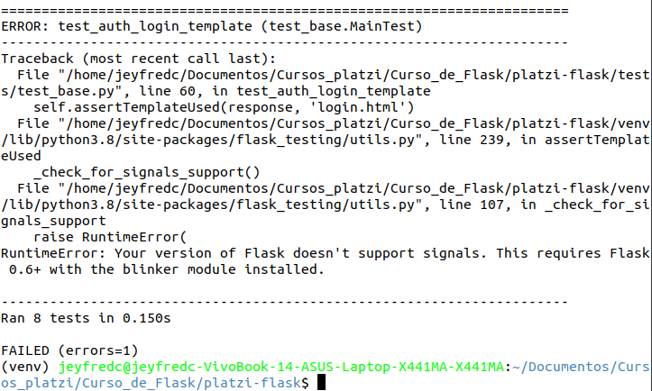

para instalarlo se debe agregar al archivo **requirements.txt**

```
flask 
flask-bootstrap
flask-wtf
flask-testing
blinker
```

y luego ejecutar en consola para instalar `pip install -r requirements.txt`

al ejecutar nuevamente las pruebas sale otro error, que indica que el template no tiene el atributo 'login.html'


el Test No. 8 se debe corregir y quitar el response, queda de esta forma

```
    # El octavo Test es para probar que el login esta rendereando correctamente
    def test_auth_login_template(self):
        self.client.get(url_for('auth.login'))

        self.assertTemplateUsed('login.html')
```

despues de correr las pruebas ya deben salir los 8 test OK

para probar que este funcionando ir a la ruta `localhost:5000/auth/login` o `http://127.0.0.1:5000/auth/login` y verificar que el template cargue

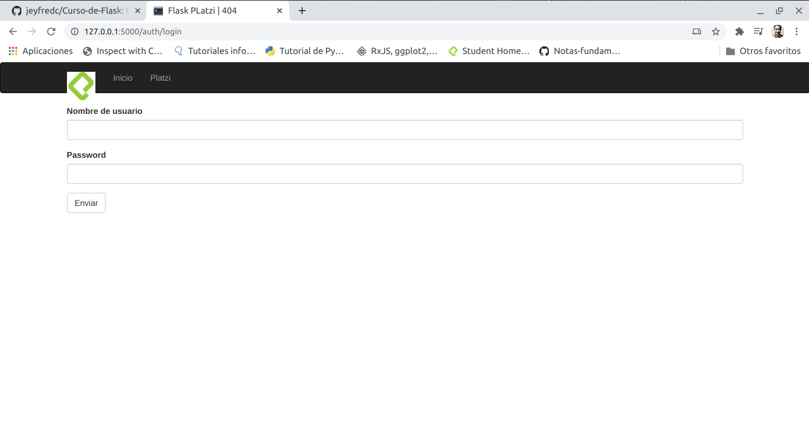

## Clase 24 Blueprints II

en el archivo **main.py** se va a modificar, se va a comentar todo lo que contiene LoginForm, el archivo queda asi 

```
from flask import request, make_response,redirect, render_template, session, url_for, flash
from flask_bootstrap import Bootstrap
import unittest

from app import create_app
from app.forms import LoginForm

app = create_app()


todos = ['Comprar cafe', 'Enviar solicitud de compra', 'Entregar video a productor']


@app.cli.command()
def test():
    tests = unittest.TestLoader().discover('tests')
    unittest.TextTestRunner().run(tests)


@app.errorhandler(404)
def not_found(error):
    return render_template('404.html', error=error)


@app.errorhandler(500)
def internal_server_error(error):
    return render_template('500.html', error=error)


@app.route('/')
def index():
    user_ip = request.remote_addr

    response = make_response(redirect('/hello'))

    session['user_ip'] = user_ip

    return response

@app.route('/hello', methods = ['GET'])
def hello():
    user_ip = session.get('user_ip')
    # login_form = LoginForm()
    username = session.get('username')

    context ={
        'user_ip': user_ip,
        'todos': todos,
        # 'login_form': login_form,
        'username': username
    }

    # if login_form.validate_on_submit():
    #     username = login_form.username.data
    #     session['username'] = username
    #     flash('nombre de usuario registrado con éxito!')

    #     return redirect(url_for('index'))

    return render_template('hello.html', **context)
```

y toda la parte del if statement del login se va a copiar a el archivo **views.py**, el archivo queda asi

```
from flask import render_template

from app.forms import LoginForm

from . import auth

@auth.route('/login')
def login():
    context = {
        'login_form': LoginForm()
    }

    # if login_form.validate_on_submit():
    #     username = login_form.username.data
    #     session['username'] = username
    #     flash('nombre de usuario registrado con éxito!')

    #     return redirect(url_for('index'))
    return render_template('login.html', **context)
```

el archivo **hello.html**, tambien se modifica y se quita la parte donde se estaba cargando Bootstrap para el Login, entonces se elimina y queda lo siguiente

```





    {{ super() }}
    Bienvenido




    

        <h1>Bienvenido, {{ username | capitalize }}</h1> <!-- capitalize es para que la primer letra aparezca en mayuscula -->

    

    

        <h3>Tu Ip es {{ user_ip }}</h3>

    
        <a href="{{ url_for('index') }}">Ir a inicio</a>
    

    <ul>
        
            {{macros.render_todo(todo)}}
        
    </ul>

```

el archivo **test_base.py** tambien se modifica en el quinto test, donde se espera que el archivo hello al hacer GET marque el error 405

el archivo queda asi

```
from flask_testing import TestCase
from flask import current_app, url_for
#Se importa la aplicacion de Flask
from main import app

class MainTest(TestCase):
    # Se implementa el metodo create_app que vive en la clase TestCase y tiene que regresar una aplicacion de Flask
    def create_app(self):
        app.config['TESTING'] = True # Se configura la aplicacion para testing
        app.config['WTF_CSRF_ENABLED'] = False # Se indica que no se va a utilizar el CSRF( Cross-site request forgery o falsificación de petición en sitios cruzados) de las formas porque en este caso no existe una sesion activa del usuario
        
        return app

    # El primer Test es para probar que la app de Flask existe
    def test_app_exists(self):
        self.assertIsNotNone(current_app)

    # El segundo Test es para probar que la app se encuentra en modo Testing
    def test_app_in_test_mode(self):
        self.assertTrue(current_app.config['TESTING'])

    # El tercer Test es para probar que index redirige a hello
    def test_index_redirects(self):
        response = self.client.get(url_for('index'))

        self.assertRedirects(response, url_for('hello'))

    # El cuarto Test es para probar que al hacer un GET de hello el servidor esta enviando una respuesta 200 o una respuesta OK
    def test_hello_get(self):
        response = self.client.get(url_for('hello'))

        self.assert200(response)

    # El quinto Test es para probar que al hacer un POST en hello el servidor traiga el error 405
    def test_hello_post(self):
        # fake_form = {
        #     'username': 'fake',
        #     'password': 'fake-password'
        # }

        response = self.client.post(url_for('hello'))

        self.assertTrue(response.status_code, 405)

    # El sexto Test es para probar que el Blueprint esta creado y registrado
    def test_auth_blueprint_exists(self):
        self.assertIn('auth', self.app.blueprints)

    # El septimo Test es para probar que en la ruta auth existe login y al hacer GET el servidor envia una respuesta 200
    def test_auth_login_get(self):
        response = self.client.get(url_for('auth.login'))

        self.assert200(response)

    
    # El octavo Test es para probar que el login esta rendereando correctamente
    def test_auth_login_template(self):
        self.client.get(url_for('auth.login'))

        self.assertTemplateUsed('login.html')
```

correr pruebas en Flask y verificar que los 8 Test esten OK

Despues de esto en el archivo **views.py** se crea la variable loginForm pra poderla utilizar en el contexto y se descomenta el if statement que se trajo alli y se importa todo lo que hace falta para que funcione correctamente la aplicacion

```
from flask import render_template, session, redirect, flash, url_for 

from app.forms import LoginForm

from . import auth

@auth.route('/login', methods=['GET', 'POST'])
def login():
    login_form = LoginForm()
    context = {
        'login_form': login_form
    }

    if login_form.validate_on_submit():
        username = login_form.username.data
        session['username'] = username
        flash('nombre de usuario registrado con éxito!')

        return redirect(url_for('index'))
    return render_template('login.html', **context)
```

Ahora borrar todo el codigo comentado en **main.py**.

Agregar a **test_base.py** la siguiente prueba

```
    # El noveno Test es para probar que al hacer POST en login redirige a index
    def test_auth_login_post(self):

        fake_form = {
        'username': 'fake',
        'password': 'fake-password'
        }

        response = self.client.post(url_for('auth.login'), data= fake_form)
        self.assertRedirects(response, url_for('index'))
```

correr las prueb y verificar que los 9 Test esten OK

y ahora al ir a la ruta `localhost:5000/auth/login` o `http://127.0.0.1:5000/auth/login` y hacer login debe redireccionar correctamente a index y mostrar toda la informacion

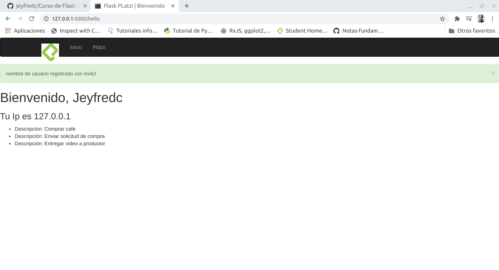

## Clase 25 Base de datos y App Engine con Flask

- **Bases de Datos SQL:** su composición esta hecha con bases de datos llenas de tablas con filas que contienen campos estructurados. No es muy flexible pero es el más usado. Una de sus desventajas es que mientras más compleja sea la base de datos más procesamiento necesitará.

- **Base de Datos NOSQL:** su composición es no estructurada, es abierta y muy flexible a diferentes tipos de datos, no necesita tantos recursos para ejecutarse, no necesitan una tabla fija como las que se encuentran en bases de datos relacionales y es altamente escalable a un bajo costo de hardware.

Flask no tienen un ORM o un sistema de base de datos definida por defecto, un ORM es una herramienta que ayuda a convertir la informacion de la base datos a un sistema orientado a objetos. Al no tener Flask un sistema de bases de datos definido se puede implementar cualquiera, solo hay que hacer la implementacion.

Existe una extension llamada SQLalchemy y esta es un ORM para SQL, si se requiere usar esta se puede agregar al archivo **requirements.txt**.

En el proyecto del curso se va a utilizar Google Cloud Firestore, la cual es una base de datos orientada a a documentos, es decir que la estructura de los datos va tener forma de un arbol de documentos

Esta es la comparacion de equivalencias de una base relacional vs la base de Firestore

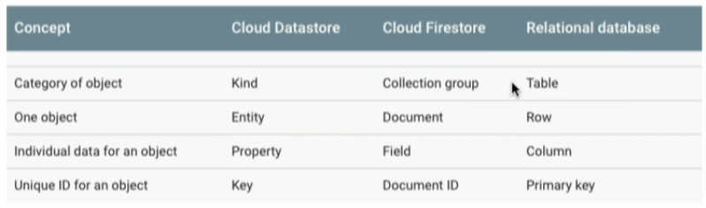

Para poder utilizar Firestore hay que instalar Google Cloud SDK, donde en la siguiente clase esta el paso a paso que se debe seguir para instalar en windows, mac y linux.

Adicional se debe crear una cuenta en Google Cloud Plataform

## Clase 26 Configuración de Google Cloud SDK

Ahora vamos a instalar el Google Cloud SDK. Simplemente debemos descargar un ejecutable desde alguno de estos enlaces:

Para Windows dirígete a https://cloud.google.com/sdk/docs/quickstart-windows
Para MacOS dirígete a link https://cloud.google.com/sdk/docs/quickstart-macos
Para Linux dirígete a https://cloud.google.com/sdk/docs/quickstart-linux

Una vez que corrimos el instalador, podemos verificar que instalamos correctamente el SDK corriendo en una terminal el siguiente comando:

```
which gcloud
```

Ahora inicializamos gcloud y hacemos login con:
```
gcloud init
gcloud auth login
```

## Clase 27 Configuración de proyecto en Google Cloud Platform

Despues de realizar la instalacion y autenticacion por consola, ahora hay que ingresar al siguiente link https://console.cloud.google.com/projectcreate y crear el nuevo proyecto el cual se va a llamar platzi-flask y para poderlo crear debajo del campo Project Name saldra una sugerencia para poder crear el proyecto, cuando este confirmada dar click en crear

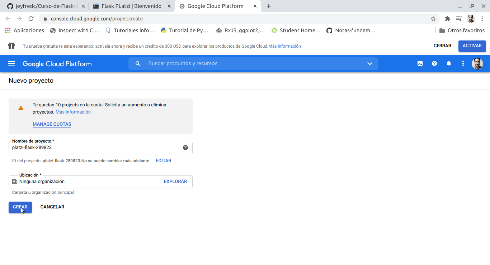

Despues de esto va a aparecer que fue creado con exito el proyecto y en la parte izquierda del menu de navegacion de Google Cloud, desplegar hasta donde este ALMACENAMIENTO y dar click en Firestore

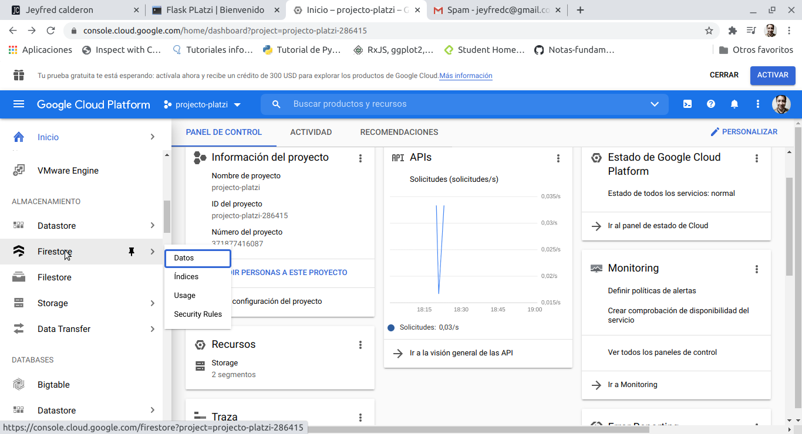

Es necesario fijarse que esten en el proyecto creado donde esta seleccion el cuadro en blanco

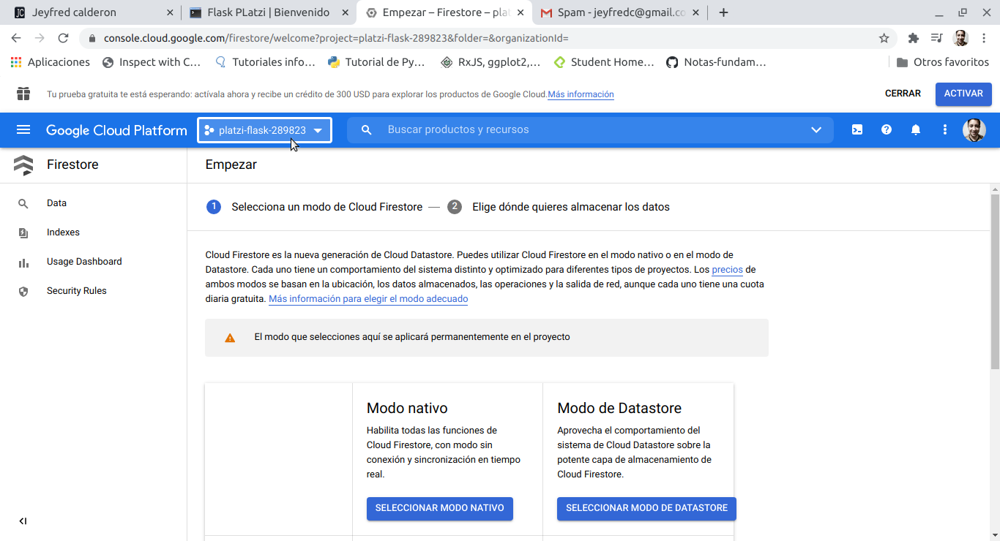

Luego seleccionar el modo nativo y despues seleccionar en locacion us-east1(South Carolina)


y luego dar click en crear base de datos

Posterior a esto en la terminal autenticarse con 

```
gcloud auth login
```

autenticarse y regresar al navegador para crear una coleccion donde dice iniciar coleccion, dar click y en la parte derecha del navegador y crear los datos como en el ejemplo a continuacion

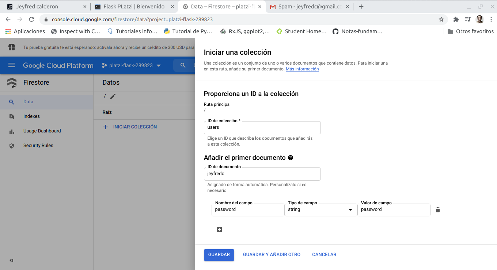

Ahora dar click en iniciar coleccion como aparece en la imagen 

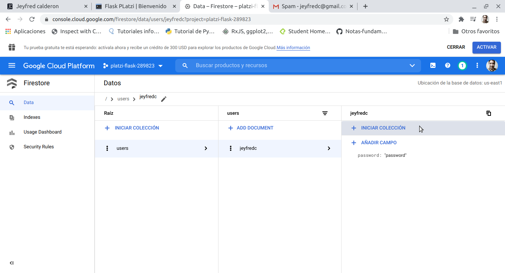

El id del documento no importa por tanto puede ser aleatorio, el resto de campos colocarlos como la imagen

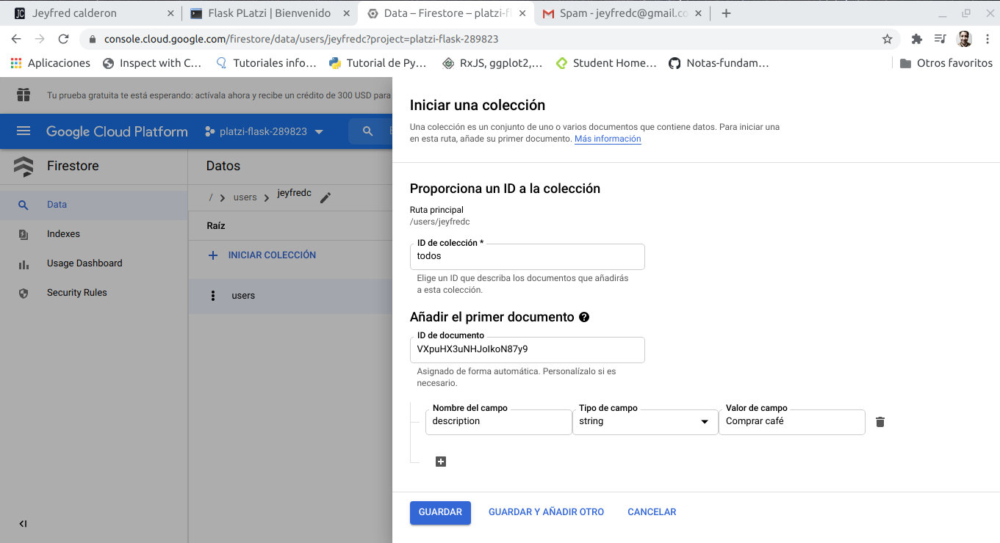

y la imagen que aparece a continuacion es como debe estar la estructura de la base de datos en el momento

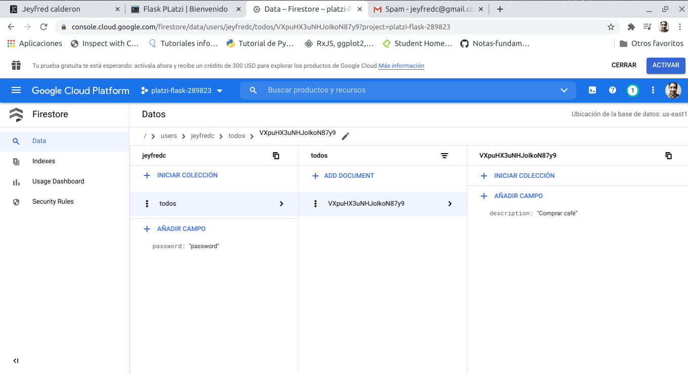

Ahora para poder autenticar la base de datos en consola se debe ejecutar el siguiente comando

```
gcloud auth application-default login
```

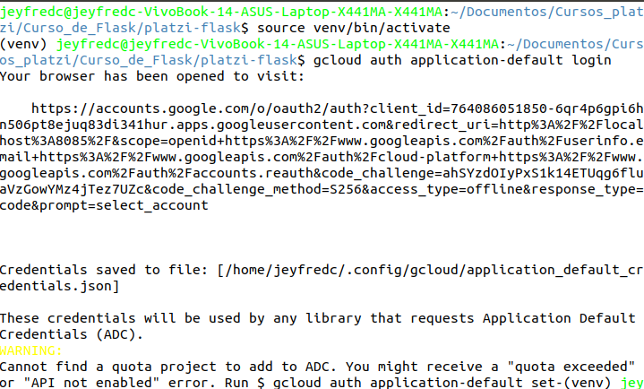

autenticar y dar los permisos para que quede conectada la base de datos con el servidor

## Clase 28 Implementación de Firestore

En el archivo **requirements.txt** crear `firebase-admin`, que es lo que va a ayudar a poder establecer comunicacion con la base de datos

**requirements.txt**

```
flask 
flask-bootstrap
flask-wtf
flask-testing
blinker
firebase-admin
```

y ejecutar en la consola `pip install -r requirements.txt`

Dentro de la carpeta **app** crear un nuevo archivo llamado **firestore_service.py**, el cual va a llevar la configuracion de la base de datos

Se importa `firebase_admin` y de esta misma se trae `credentials` para comunicarnos con firestore y tambien a `firestore`

Se crea una `credential = credential.ApplicationDefault()` que es la manera en la que nos vamos a comunicar, en consola lo haciamos de esta forma 

```
gcloud auth application-default login
```
Despues `firebase_admin.initialize_app(credential)` donde se manda a la credencial

Se crea una nueva instancia del servicio de firestore `db = firestore.client()` para comunicarnos con la base de datos

y el primer metodo sirve para obtener todo lo que creamos en la coleccion de usuarios 

```
def get_users():
    return db.collection('users').get()
```

**firestore_service.py**

```
import firebase_admin
from firebase_admin import credentials
from firebase_admin import firestore


project_id = 'platzi-flask-289823' ## Aqui se debe colocar el id del proyecto de quien lo realice

cred = credentials.ApplicationDefault()

firebase_admin.initialize_app(cred, {
  'projectId': project_id,
})

db = firestore.client()

def get_users():
    return db.collection('users').get()
```

Ahora en **main.py** se realiza una modificacion para hacer la prueba de que se estan obteniendo los usuarios

se debe importar `from app.firestore_service import get_users` y debajo del contexto indicar que `users = get_users()` y esto va a regresar una lista de usuarios sobre la cual se puede iterar 

```
    for user in users:
        print(user)

```

**main.py**

```
from flask import request, make_response,redirect, render_template, session, url_for, flash
from flask_bootstrap import Bootstrap
import unittest

from app import create_app
from app.forms import LoginForm
from app.firestore_service import get_users

app = create_app()


todos = ['Comprar cafe', 'Enviar solicitud de compra', 'Entregar video a productor']


@app.cli.command()
def test():
    tests = unittest.TestLoader().discover('tests')
    unittest.TextTestRunner().run(tests)


@app.errorhandler(404)
def not_found(error):
    return render_template('404.html', error=error)


@app.errorhandler(500)
def internal_server_error(error):
    return render_template('500.html', error=error)


@app.route('/')
def index():
    user_ip = request.remote_addr

    response = make_response(redirect('/hello'))

    session['user_ip'] = user_ip

    return response

@app.route('/hello', methods = ['GET'])
def hello():
    user_ip = session.get('user_ip')
    username = session.get('username')

    context ={
        'user_ip': user_ip,
        'todos': todos,
        'username': username
    }

    users = get_users()

    for user in users:
        print(user.id)
        print(user.to_dict()['password'])

    return render_template('hello.html', **context)
```

luego verificar que este funcionando todo con el servidor prendido y autenticado en la base datos, en caso de que no funcione desactivar todo, reiniciar la consola y hacer paso por paso todo 


- hacer login desde la terminal: gcloud auth login

- hacer login application-default: gcloud auth application-default login

- inicializar: gcloud init

- Activar venv source venv/bin/activate

- export FLASK_APP=main.py

- export FLASK_DEBUG=1

- export FLASK_ENV=development

- export GOOGLE_CLOUD_PROJECT='PROJECT_ID'

- flask run

y probar que este funcionando nuevamente, en caso que no, se debera verificar todo o hacer la consulta en internet

En caso de tener mas archivos configurados con Google Cloud, en la terminal escribir

```
gloud config list
```
y verificar que este el nombre del proyecto, si no esta configurado entonces ejecutar la siguiente linea en la terminal

```
gcloud config set project nombre-del-proyecto
```
verificando que todo este funcionando y cargando la pagina 

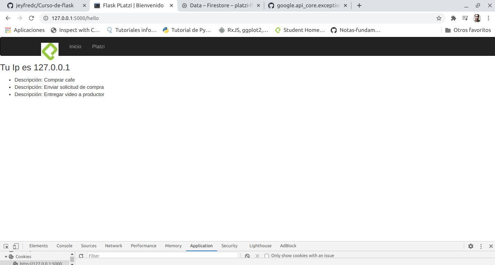

en la terminal debe aparecer el password y el nombre de usuario

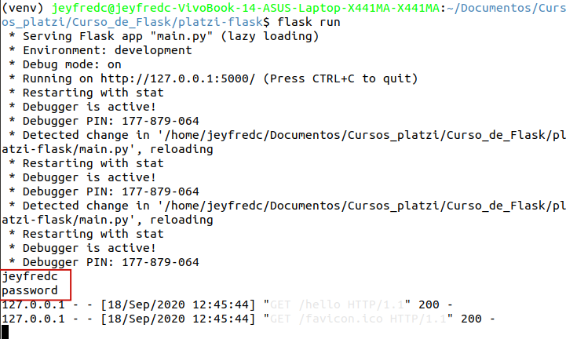

si se quiere cambiar el password, hay que cambiar el campo directamente en la base de datos de Googled Cloud

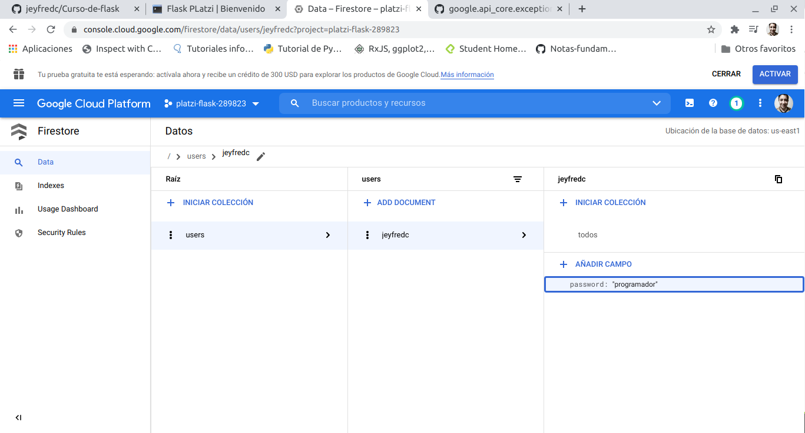

nuevamente recargar la pagina y luego ir a la terminal para verificar que datos esta obteniendo

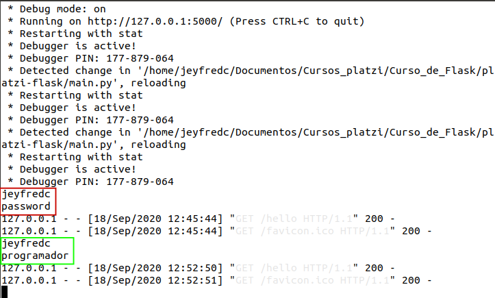

Ahora en **main.py** eliminar la lista de todos `todos = ['Comprar cafe', 'Enviar solicitud de compra', 'Entregar video a productor']`, guardar y ahora configurar en **firestore_service.py**, la funcion que va a obtener los todos de la base de dato

```
def get_todos(user_id):
    return db.collection('users').document(user_id).collection('todos')
```

**firestore_service.py**

```
import firebase_admin
from firebase_admin import credentials
from firebase_admin import firestore


project_id = 'platzi-flask-289823'

cred = credentials.ApplicationDefault()

firebase_admin.initialize_app(cred, {
  'projectId': project_id,
})

db = firestore.client()

def get_users():
    return db.collection('users').get()

def get_todos(user_id):
    return db.collection('users').document(user_id).collection('todos').get()
```
y en **main.py** importar la funcion `get_todos` `from app.firestore_service import get_users, get_todos` par configurar en la ruta hello

**main.py**

```
from flask import request, make_response,redirect, render_template, session, url_for, flash
from flask_bootstrap import Bootstrap
import unittest

from app import create_app
from app.forms import LoginForm
from app.firestore_service import get_users, get_todos

app = create_app()


todos = ['Comprar cafe', 'Enviar solicitud de compra', 'Entregar video a productor']


@app.cli.command()
def test():
    tests = unittest.TestLoader().discover('tests')
    unittest.TextTestRunner().run(tests)


@app.errorhandler(404)
def not_found(error):
    return render_template('404.html', error=error)


@app.errorhandler(500)
def internal_server_error(error):
    return render_template('500.html', error=error)


@app.route('/')
def index():
    user_ip = request.remote_addr

    response = make_response(redirect('/hello'))

    session['user_ip'] = user_ip

    return response

@app.route('/hello', methods = ['GET'])
def hello():
    user_ip = session.get('user_ip')
    username = session.get('username')

    context ={
        'user_ip': user_ip,
        'todos': get_todos(user_id=username),
        'username': username
    }

    users = get_users()

    for user in users:
        print(user.id)
        print(user.to_dict()['password'])

    return render_template('hello.html', **context)
```

Despues de guardar los cambios ir al navegador, borrar las cookies y autenticarse en la ruta `http://127.0.0.1:5000/auth/login`

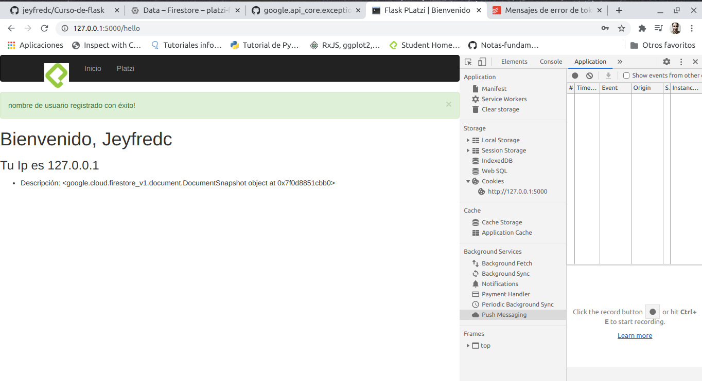

como se puede apreciar no esta obteniendo los datos de la coleccion todos, para eso hay que hacer una modificacion en el archivo **macros.html**, para eso hay que convertir la macro en un diccionario y obtener la descripcion

```

    <li>Descripción: {{todo.to_dict().description }}</li>

```

posterior a esto guardar el archivo, volver a recargar autenticandose y verificar que aparezca la descripcion de la lista creada en la base de datos

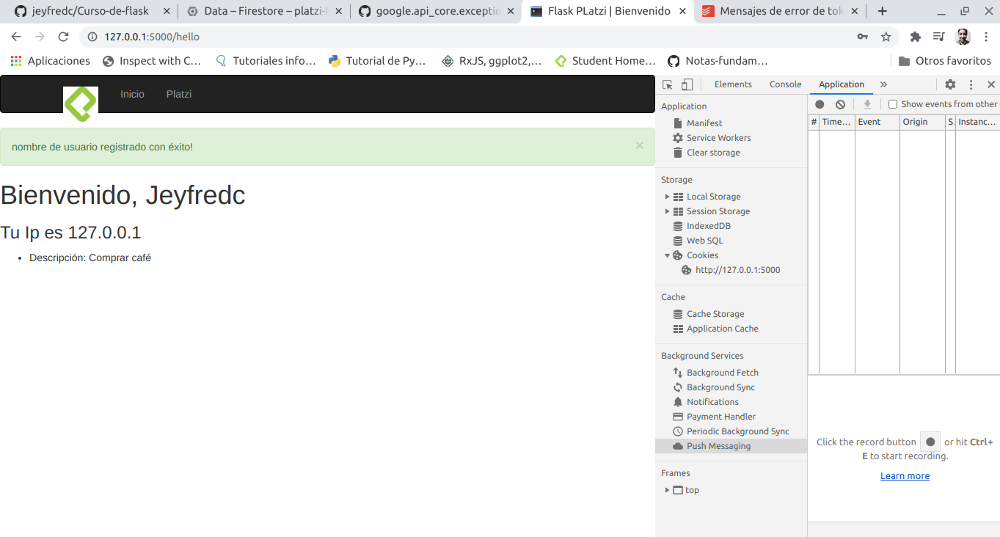

si se agrega otro documento a la base de datos 

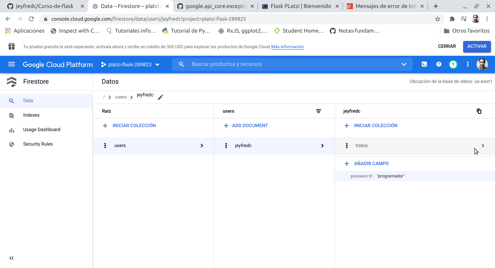

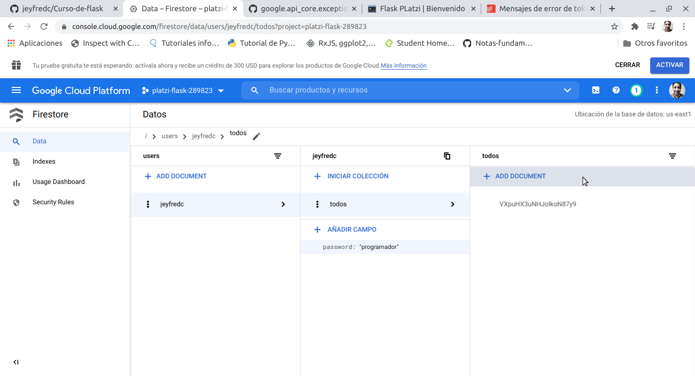

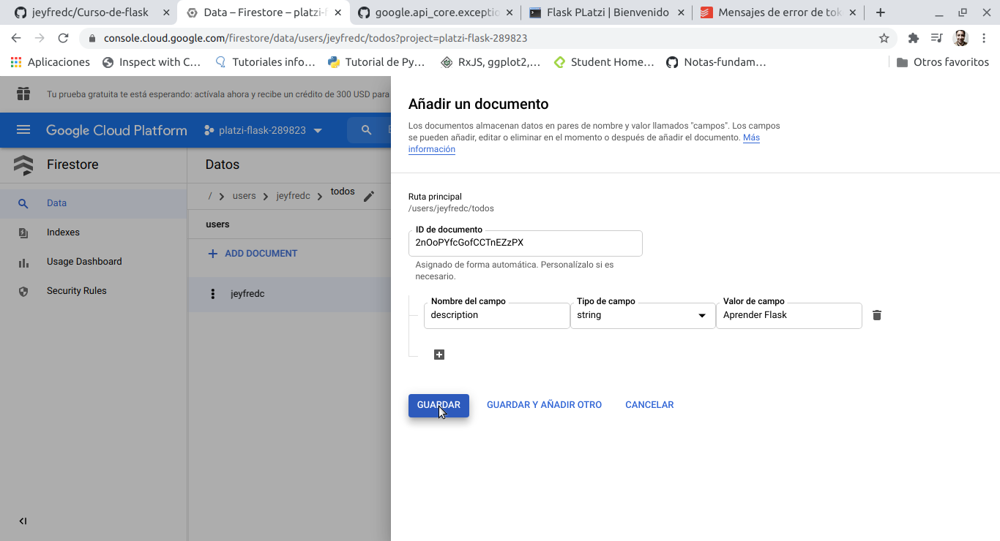

al recargar la pagina nuevamente, debe aparecer la nueva coleccion de todos

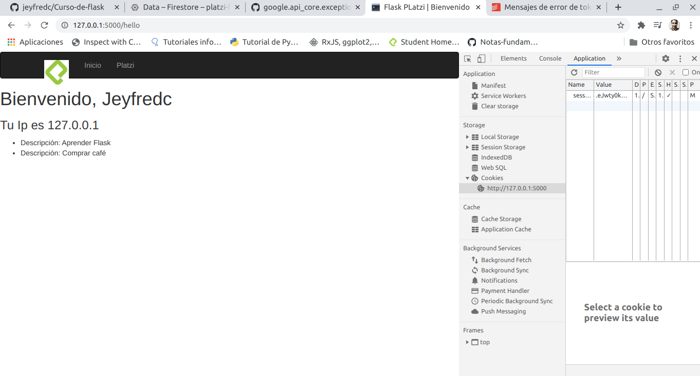

## Clase 29 Autenticación de usuarios: Login

En esta clase vamos a implementar Flask login para poder hacer autenticacion directamente en la consola, verificar el password, que el usuario existe y despues realizar login del usuario, lo primero a realizar es el for que quedo en el contexto de **main.py**

Es decir borrar estas 3 lineas de codigo y guardar cambios
```
    for user in users:
        print(user.id)
        print(user.to_dict()['password'])
```

Realizar la instalacion de `flask-login` en los **requirements.txt**

```
flask 
flask-bootstrap
flask-wtf
flask-testing
blinker
firebase-admin
flask-login
```
y ejecutar `pip install -r requirements.txt`

Lo primero que hay que hacer es implementar un login manager el cual va a inicializar la app y tambien va a permitir cargar al usuario con una funcion que se llama LoadUser y de esa manera se podra crear al usuario, con una funcion en la que se hace un query directamente a la base de datos, con el id que mande esta funcion

En el archivo **__init__.py** que esta guardado en la carpeta **app**.

Se debe importar `from flask_login import LoginManager`

Despues a la app se le indica que `login_manager = LoginManager()` y luego decirle cual es la ruta del login que se quiere que maneje `login_manager.login_view = 'auth.login'`

y antes de registrar el Blueprint se indica que debe inicializar la aplicacion `login_manager.init_app(app)`

**__init__.py**

```
from flask import Flask
from flask_bootstrap import Bootstrap
from flask_login import LoginManager

from .config import Config
from .auth import auth
from .models import UserModel


login_manager = LoginManager()
login_manager.login_view = 'auth.login'


@login_manager.user_loader
def load_user(username):
    return UserModel.query(username)


def create_app():
    app = Flask(__name__)
    bootstrap = Bootstrap(app)

    app.config.from_object(Config)
    
    login_manager.init_app(app)

    app.register_blueprint(auth)

    return app
```

Hasta hay todo debe funcionar para poder proteger una ruta con un decorador que se llama login_required, este se debe importar en **main.py** `from flask_login import login_required` y el decorador se debe colocar debajo de la ruta hello, posteriormente colocare todo el codigo, por ahora hay que crear un nuevo archivo que se llama UserModel porque flask login solicita tener un modelo de usuario especifico para que se pueda utilizar la funcion **load_user** o **user_loader** que se puede obtener de la documentacion https://flask-login.readthedocs.io/en/latest/, la documentacion indica que se debe crear un modelo de usuario que implemente las propiedades **is_ authenticated, is_active, is_anonymous y get_id()** para que flaks login pueda hacer lo que necesita para que nosotros tengamos un usuario registrado en la sesion y que podamos obtener las propiedades en los templates

A continuacion se va a crear un nuevo archivo en la carpeta **app** que se va a llamar **models.py** donde se va a crear la clase **UserModel** y tambien de `flask_login import UserMixin` se importa UserMixin el cual ya trae las propiedades **is_ authenticated, is_active, is_anonymous y get_id()**

Se crea la clase User Data que recibe por parametro username y el password y luega esta pasa por la clase UserModel que se trae a traves de la data, posteriormente se crea la funcion query para obtener los dqatps que se pasen como usuario y password

**models.py**

```
from flask_login import UserMixin

from .firestore_service import get_user
class UserData:
    def __init__(self, username, password):
        self.username = username
        self.password = password


class UserModel(UserMixin):
    def __init__(self, user_data):
        """ 
        :param user_data: UserData
         """
        self.id = user_data.username
        self.password = user_data.password


    @staticmethod
    def query(user_id):
        user_doc = get_user(user_id)
        user_data = UserData(
            username = user_doc.id,
            password = user_doc.to_dict()['password']
        )

        return UserModel(user_data)
```

En el archivo **firestore_service** se trae la funcion 

```
def get_user(user_id):
    return db.collection('users').document(user_id).get()
```

para obtener los datos del usuario en la base de datos

**firestore_service**

```
import firebase_admin
from firebase_admin import credentials
from firebase_admin import firestore


project_id = 'platzi-flask-289823'

cred = credentials.ApplicationDefault()

firebase_admin.initialize_app(cred, {
  'projectId': project_id,
})

db = firestore.client()


def get_users():
    return db.collection('users').get()


def get_user(user_id):
    return db.collection('users').document(user_id).get()


def get_todos(user_id):
    return db.collection('users').document(user_id).collection('todos').get()
```
y como se habia mencionado anteriormente en **main.py** se importa login required y se implementa el decorador debajo de la ruta hello

**main.py**

```
import unittest
from flask import request, make_response,redirect, render_template, session, url_for, flash
from flask_login import login_required

from app import create_app
from app.forms import LoginForm
from app.firestore_service import get_users, get_todos

app = create_app()


todos = ['Comprar cafe', 'Enviar solicitud de compra', 'Entregar video a productor']


@app.cli.command()
def test():
    tests = unittest.TestLoader().discover('tests')
    unittest.TextTestRunner().run(tests)


@app.errorhandler(404)
def not_found(error):
    return render_template('404.html', error=error)


@app.errorhandler(500)
def internal_server_error(error):
    return render_template('500.html', error=error)


@app.route('/')
def index():
    user_ip = request.remote_addr

    response = make_response(redirect('/hello'))

    session['user_ip'] = user_ip

    return response

@app.route('/hello', methods = ['GET'])
@login_required
def hello():
    user_ip = session.get('user_ip')
    username = session.get('username')

    context ={
        'user_ip': user_ip,
        'todos': get_todos(user_id=username),
        'username': username
    }

    users = get_users()

    return render_template('hello.html', **context)
```

Al terminar toda la ejecucion del codigo se puede cargar la pagina correctamente pero no hay acceso a la app, esto se configura en la siquiente clase

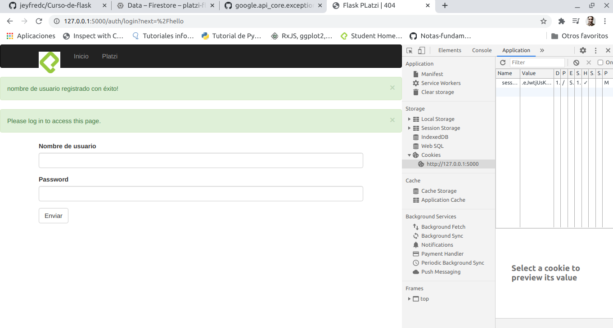

## Clase 30 Autenticación de usuarios: Logout

Actualemente solo se esta guardando el usuario en la session, entonces hay que validar despues de que se envie la forma y esta sea valida. Hay que validar que el usuario realmente exista en la base de datos.

En la carpeta **app** y en la subcarpeta **auth**, se creo un archivo llamado **views.py**, alli se tiene que modificar el archivo en la loginform

en el if statements ya esta creado el username y despues de este hay que crear el password y luego hay que buscar ese userDocument y la forma de buscarlo es importando get_user de firestore_service `from app.firestore_service import get_user` y el userdoc es igual a get_user con el username, despues se hace una comparacion entre el password de la base de datos y el ingresado, si son iguales entra a validar si es correcto y despues obtiene el mensaje de bienvenida, tambien fue necesario importar `from app.models import UserModel, UserData` para hacer las validaciones

**views.py**

```
from flask import render_template, session, redirect, flash, url_for 
from flask_login import login_user

from app.forms import LoginForm

from . import auth
from app.firestore_service import get_user
from app.models import UserModel, UserData

@auth.route('/login', methods=['GET', 'POST'])
def login():
    login_form = LoginForm()
    context = {
        'login_form': login_form
    }

    if login_form.validate_on_submit():
        username = login_form.username.data
        password = login_form.password.data

        user_doc = get_user(username)

        if user_doc.to_dict() is not None:
            password_from_db = user_doc.to_dict()['password']

            if password == password_from_db:
                user_data = UserData(username, password)
                user = UserModel(user_data)

                login_user(user)

                flash('Bienvenido de nuevo')

                redirect(url_for('hello'))
            else:
                flash('La informacion no coincide')

        else:
            flash('El usuario no existe')

        flash('nombre de usuario registrado con éxito!')

        return redirect(url_for('index'))
    return render_template('login.html', **context)
```

Se hace modificacion en **main.py** importando current_user `from flask_login import login_required, current_user` y en username de la funcion hello se reemplaza por `username = current_user.id`

**main.py**

```
import unittest
from flask import request, make_response,redirect, render_template, session, url_for, flash
from flask_login import login_required, current_user

from app import create_app
from app.forms import LoginForm
from app.firestore_service import get_users, get_todos

app = create_app()


todos = ['Comprar cafe', 'Enviar solicitud de compra', 'Entregar video a productor']


@app.cli.command()
def test():
    tests = unittest.TestLoader().discover('tests')
    unittest.TextTestRunner().run(tests)


@app.errorhandler(404)
def not_found(error):
    return render_template('404.html', error=error)


@app.errorhandler(500)
def internal_server_error(error):
    return render_template('500.html', error=error)


@app.route('/')
def index():
    user_ip = request.remote_addr

    response = make_response(redirect('/hello'))

    session['user_ip'] = user_ip

    return response

@app.route('/hello', methods = ['GET'])
@login_required
def hello():
    user_ip = session.get('user_ip')
    username = current_user.id

    context ={
        'user_ip': user_ip,
        'todos': get_todos(user_id=username),
        'username': username
    }

    return render_template('hello.html', **context)
```

Ahora al hacer login en la aplicacion ya nos podemos autenticar con la contraseña establecida en la base de datos, la cual en mi caso la habia cambio de password a programador

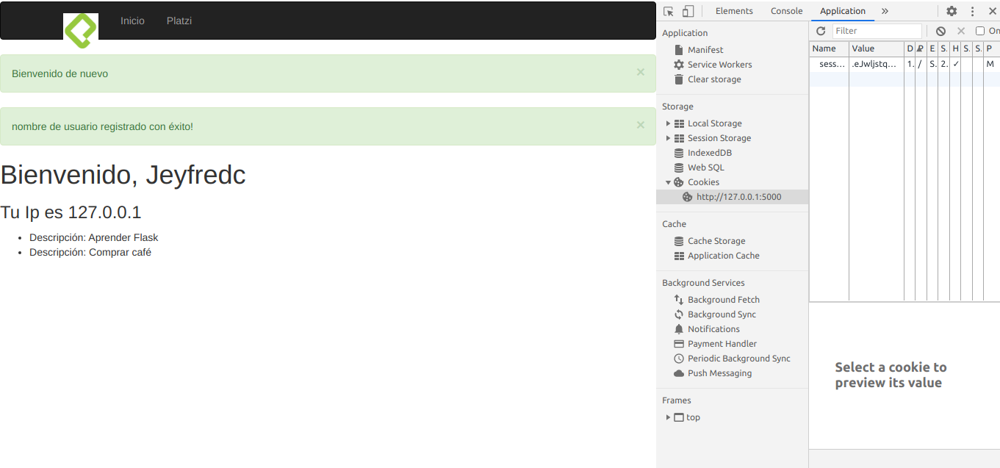

Ahora se va a crear un Logout para tener la posibilidad de salir de la aplicacion y modificar el navbar para que si encontramos al usuario, exista la ruta del Logout y si no hay un usuario autenticado exista la ruta del Login

Dentro **views.py** al final del codigo se va a crear la funcion `logout` para configurar la funcion se debe importar `from flask_login import login_user, login_required, logout_user`, va a tener la ruta a logout y redirigir al login con un mensaje de Regresa pronto

```
from flask import render_template, session, redirect, flash, url_for 
from flask_login import login_user, login_required, logout_user

from app.forms import LoginForm

from . import auth
from app.firestore_service import get_user
from app.models import UserModel, UserData

@auth.route('/login', methods=['GET', 'POST'])
def login():
    login_form = LoginForm()
    context = {
        'login_form': login_form
    }

    if login_form.validate_on_submit():
        username = login_form.username.data
        password = login_form.password.data

        user_doc = get_user(username)

        if user_doc.to_dict() is not None:
            password_from_db = user_doc.to_dict()['password']

            if password == password_from_db:
                user_data = UserData(username, password)
                user = UserModel(user_data)

                login_user(user)

                flash('Bienvenido de nuevo')

                redirect(url_for('hello'))
            else:
                flash('La informacion no coincide')

        else:
            flash('El usuario no existe')

        return redirect(url_for('index'))
    return render_template('login.html', **context)


@auth.route('logout')
@login_required
def logout():
    logout_user()
    flash('Regresa pronto')
    
    return redirect(url_for('auth.login'))
```
Ahora hay que modificar el template **navbar.html**, para que el usuario pueda salir 

```
<div class="navbar navbar-inverse" role="navigation">
    <div class="container">
        <div class="navbar-header">
            <button type="button"
                    class="navbar-toggle"
                    data-toggle="collapse"
                    data-target=".navbar-collapse">
                <span class="sr-only">Toggle navigation</span>
                <span class="icon-bar"></span>
                <span class="icon-bar"></span>
                <span class="icon-bar"></span>
            </button>
            <a class="navbar-brand" href="{{ url_for('index') }}">
                
            </a>
        </div>

        <div class="navbar-collapse collapse">
            <ul class="nav navbar-nav">
                
                <li><a href="{{ url_for('auth.logout') }}">Salir</a></li>
                
                <li><a href="{{ url_for('index') }}">Inicio</a></li>
                <li><a href="https://platzi.com" target="_blank">Platzi</a></li>
            </ul>
        </div>
    </div>
</div>
```

Al ingresar debe aparecer la opcion de salir

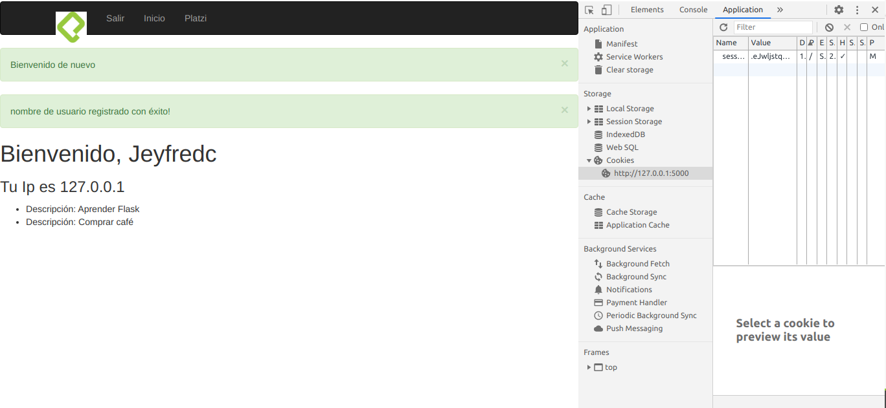

y al dar click en salir el mensaje en http://127.0.0.1:5000/auth/login sera Regresa pronto

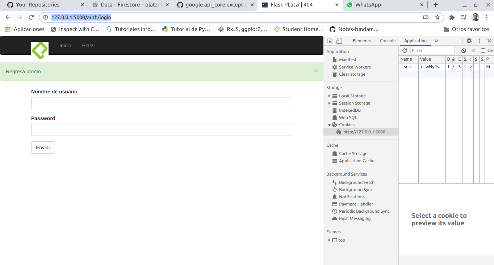

## Clase 31 Signup

En esta clase se hara registro de usuario, para ello se va a crear una nueva ruta llamada **Signup**, donde se utilizar la misma forma de Login pero las validaciones que se haran sobre la ruta van a ser diferentes y tambien se debe encriptar el password por seguridad, **nadie debe conocer el password de los usuarios mas que el propio usuario**

en el archivo **views.py** se va a crear una funcion llamada **singup** el cual va a tener un decorador para establecer la ruta signup

se importa una nueva loginForm pero se va a llamar **signup_form**, se agrega al contexto, se añade el template que aun no se ha creado y se amplia el contexto.

Posteriormente se hace la validacion donde primero se busca si ya existe el usuario, si existe no genera nada, pero si no se debe generar un password seguro para lo cual se importa `from werkzeug.security import genetare_password_hash`, la cual es una libreria de seguridad del password 

para poder asignar al usuario a la base de datos se debe importar el metodo **user_put**, el cual aun no se ha creado pero se establece en el codigo

```
from flask import render_template, session, redirect, flash, url_for 
from flask import render_template, session, redirect, flash, url_for 
from flask_login import login_user, login_required, logout_user
from werkzeug.security import generate_password_hash

from app.forms import LoginForm

from . import auth
from app.firestore_service import get_user, user_put
from app.models import UserModel, UserData

@auth.route('/login', methods=['GET', 'POST'])
def login():
    login_form = LoginForm()
    context = {
        'login_form': login_form
    }

    if login_form.validate_on_submit():
        username = login_form.username.data
        password = login_form.password.data

        user_doc = get_user(username)

        if user_doc.to_dict() is not None:
            password_from_db = user_doc.to_dict()['password']

            if password == password_from_db:
                user_data = UserData(username, password)
                user = UserModel(user_data)

                login_user(user)

                flash('Bienvenido de nuevo')

                redirect(url_for('hello'))
            else:
                flash('La informacion no coincide')

        else:
            flash('El usuario no existe')

        return redirect(url_for('index'))
    return render_template('login.html', **context)

@auth.route('signup', methods=['GET', 'POST'])
def signup():
    signup_form = LoginForm()
    context = {
        'signup_form': signup_form
    }

    if signup_form.validate_on_submit():
        username = signup_form.username.data
        password = signup_form.password.data

        user_doc = get_user(username)

        if user_doc.to_dict() is None:

            password_hash = generate_password_hash(password)
            user_data = UserData(username, password_hash)
            user_put(user_data)

            user = UserModel(user_data)

            login_user(user)

            flash('Bienvenido!')

            return redirect(url_for('hello'))

        else:
            flash('El usuario ay existe')


    return render_template('signup.html', **context)


@auth.route('logout')
@login_required
def logout():
    logout_user()
    flash('Regresa pronto')
    
    return redirect(url_for('auth.login'))
```

Ahora hay que crear el template para signup en la carpeta de templates crear el archivo **signup.html**

```




{{ super() }}
    Signup


    <h1>Registra una cuenta</h1>
    <div class="container">
        {{ wtf.quick_form(signup_form) }}
    </div>


```

por ultimo crear en el archivo **firestore_service.py** el metodo **user_put** para establecer y agregar los datos a la base datos

```
import firebase_admin
from firebase_admin import credentials
from firebase_admin import firestore


project_id = 'platzi-flask-289823'

cred = credentials.ApplicationDefault()

firebase_admin.initialize_app(cred, {
  'projectId': project_id,
})

db = firestore.client()


def get_users():
    return db.collection('users').get()


def get_user(user_id):
    return db.collection('users').document(user_id).get()


def get_todos(user_id):
    return db.collection('users').document(user_id).collection('todos').get()


def user_put(user_data):
    user_ref = db.collection('users').document(user_data.username)
    user_ref.set({ 'password': user_data.password })
```
y despues de guardar cambios, cargar nuevamente la pagina , reiniciando cookies, y yendo a la ruta http://127.0.0.1:5000/auth/signup y crear un usuario nuevo

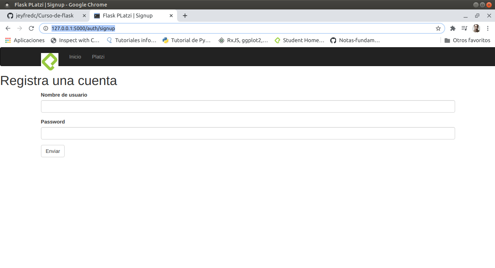

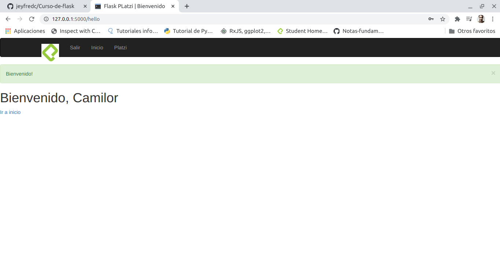

y luego verificar en la base de datos que el usuario se esta guardando con la contraseña de forma segura

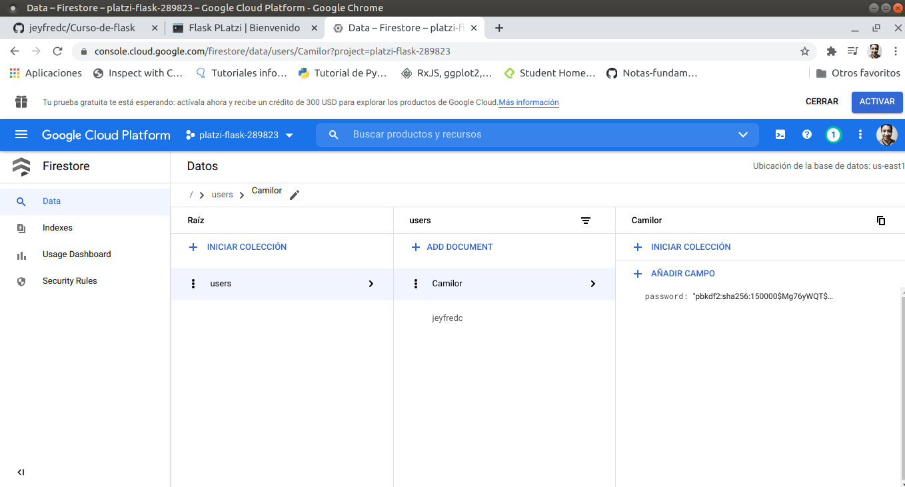

## Clase 32 Agregar tareas

En esta clase se hara la implementacion para que cualquier usuario puede agregar tareas dentro de la coleccion todos de la base de datos y lo que se va a hacer es crear una nueva clase que se llama `TodoForm`, en el archivo de **forms.py**

```
from flask_wtf import FlaskForm
from wtforms.fields import StringField, PasswordField, SubmitField
from wtforms.validators import DataRequired

class LoginForm(FlaskForm):
    username = StringField('Nombre de usuario', validators=[DataRequired()])
    password = PasswordField('Password', validators=[DataRequired()])
    submit = SubmitField('Enviar')


class TodoForm(FlaskForm):
    description = StringField('Descripción', validators=[DataRequired()])
    submit = SubmitField('Crear')
```

y en **main.py** se crea la nueva instancia de TodoForm en el metodo hello, recordar que se debe importar ademas del LoginForm, TodoForm

```
import unittest
from flask import request, make_response,redirect, render_template, session, url_for, flash
from flask_login import login_required, current_user

from app import create_app
from app.forms import LoginForm, TodoForm
from app.firestore_service import get_users, get_todos

app = create_app()


todos = ['Comprar cafe', 'Enviar solicitud de compra', 'Entregar video a productor']


@app.cli.command()
def test():
    tests = unittest.TestLoader().discover('tests')
    unittest.TextTestRunner().run(tests)


@app.errorhandler(404)
def not_found(error):
    return render_template('404.html', error=error)


@app.errorhandler(500)
def internal_server_error(error):
    return render_template('500.html', error=error)


@app.route('/')
def index():
    user_ip = request.remote_addr

    response = make_response(redirect('/hello'))

    session['user_ip'] = user_ip

    return response

@app.route('/hello', methods = ['GET'])
@login_required
def hello():
    user_ip = session.get('user_ip')
    username = current_user.id
    todo_form = TodoForm()

    context ={
        'user_ip': user_ip,
        'todos': get_todos(user_id=username),
        'username': username,
        'todo_form': todo_form
    }

    return render_template('hello.html', **context)
```

y ahora en el template **hello.html**, se crea un nuevo container para la creacion de tareas

```





    {{ super() }}
    Bienvenido




    

        <h1>Bienvenido, {{ username | capitalize }}</h1> <!-- capitalize es para que la primer letra aparezca en mayuscula -->

    

    

        <h3>Tu Ip es {{ user_ip }}</h3>

    
        <a href="{{ url_for('index') }}">Ir a inicio</a>
    

    <div class="container">
        <h2>Crea una nueva tarea</h2>

        {{ wtf.quick_form(todo_form)}}
    </div>

    <ul>
        
            {{macros.render_todo(todo)}}
        
    </ul>

```

Guardar y en la ruta hello del navegador ya debe aparecer la opcion de crear una nueva tarea

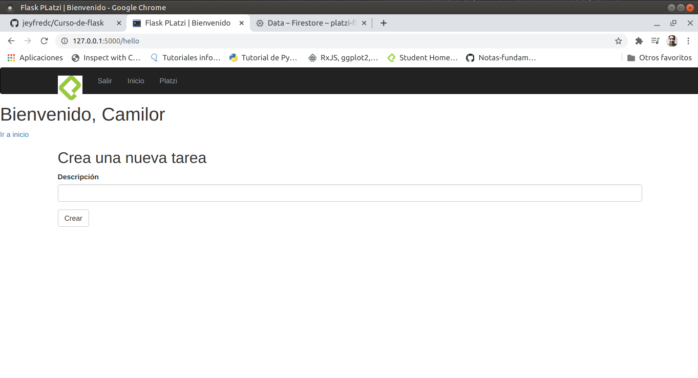

pero esto aun no comunica con la base datos, para lo cual en el archivo **firestore_service.py**, hay que crear el metodo para la conexion con la base el cual es **put_todo**, este debe tener en cuenta que debe enviar el path completo, primero va a users luego a user_id y luego a la coleccion todos 

```
import firebase_admin
from firebase_admin import credentials
from firebase_admin import firestore


project_id = 'platzi-flask-289823'

cred = credentials.ApplicationDefault()

firebase_admin.initialize_app(cred, {
  'projectId': project_id,
})

db = firestore.client()


def get_users():
    return db.collection('users').get()


def get_user(user_id):
    return db.collection('users').document(user_id).get()


def get_todos(user_id):
    return db.collection('users').document(user_id).collection('todos').get()


def user_put(user_data):
    user_ref = db.collection('users').document(user_data.username)
    user_ref.set({ 'password': user_data.password })


def put_todo(user_id, description):
    todos_collection_ref = db.collection('users').document(user_id).collection('todos')
    todos_collection_ref.add({'description': description})
```

este metodo se debe implementar debajo del contexto de la ruta hello del archivo **main.py**, se debe importar desde firestore `from app.firestore_service import get_users, get_todos, put_todo` y hacer una validacion con un if statement para poder crear la tarea

```
import unittest
from flask import request, make_response,redirect, render_template, session, url_for, flash
from flask_login import login_required, current_user

from app import create_app
from app.forms import LoginForm, TodoForm
from app.firestore_service import get_users, get_todos, put_todo

app = create_app()


todos = ['Comprar cafe', 'Enviar solicitud de compra', 'Entregar video a productor']


@app.cli.command()
def test():
    tests = unittest.TestLoader().discover('tests')
    unittest.TextTestRunner().run(tests)


@app.errorhandler(404)
def not_found(error):
    return render_template('404.html', error=error)


@app.errorhandler(500)
def internal_server_error(error):
    return render_template('500.html', error=error)


@app.route('/')
def index():
    user_ip = request.remote_addr

    response = make_response(redirect('/hello'))

    session['user_ip'] = user_ip

    return response

@app.route('/hello', methods = ['GET', 'POST'])
@login_required
def hello():
    user_ip = session.get('user_ip')
    username = current_user.id
    todo_form = TodoForm()

    context ={
        'user_ip': user_ip,
        'todos': get_todos(user_id=username),
        'username': username,
        'todo_form': todo_form
    }

    if todo_form.validate_on_submit():
        put_todo(user_id = username, description = todo_form.description.data)

        flash('Tu tarea se creo con éxito!')

        return redirect(url_for('hello'))

    return render_template('hello.html', **context)
```

Guardar, recargar el navegador y crear una tarea.

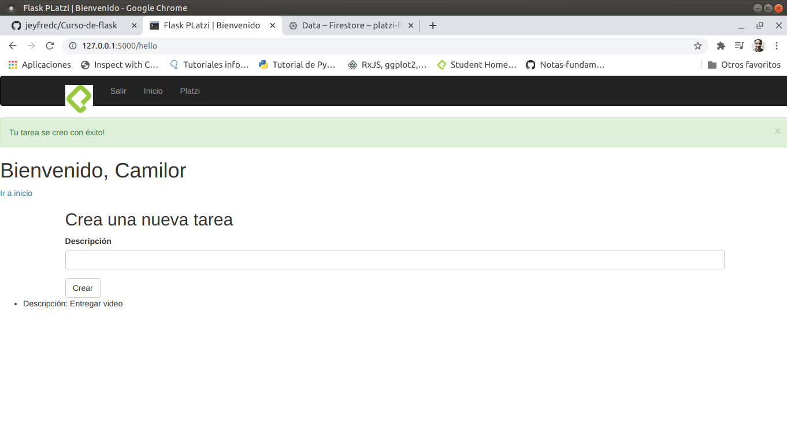

Se puede verificar en la base de datos en las subcolecciones las tareas asignadas

## Clase 33 Eliminar tareas

A continuacion dentro de la base de datos de Google Cloud, borrar las tareas que existan en la coleccion de todos, de los usuarios que existan, porque se va a agregar una nueva propiedad a los todos para decidir cuando una tarea este hecha o no

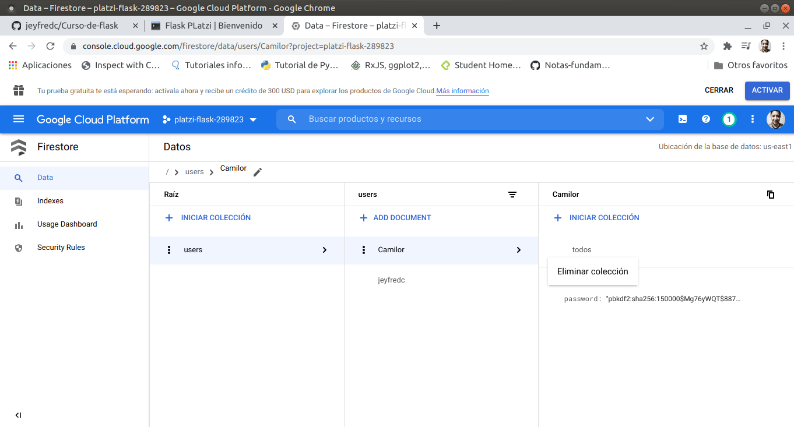

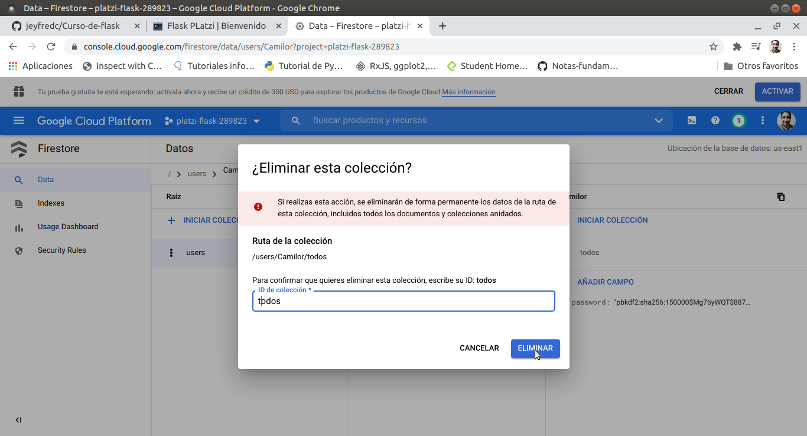

en el archivo de **firestore_service.py** en el metodo `put_todo`, se va a agregar un nuevo field que se va a llamar `done` de tipo booleano y se va a inicializar en false, es decir que la tarea no esta completa

Adicional tambien se crea el metodo `delete_todo` que recibe como parametro al `user_id` y un `todo_id` que despues va a pasar por **main.py**

```
import firebase_admin
from firebase_admin import credentials
from firebase_admin import firestore


project_id = 'platzi-flask-289823'

cred = credentials.ApplicationDefault()

firebase_admin.initialize_app(cred, {
  'projectId': project_id,
})

db = firestore.client()


def get_users():
    return db.collection('users').get()


def get_user(user_id):
    return db.collection('users').document(user_id).get()


def get_todos(user_id):
    return db.collection('users').document(user_id).collection('todos').get()


def user_put(user_data):
    user_ref = db.collection('users').document(user_data.username)
    user_ref.set({ 'password': user_data.password })


def put_todo(user_id, description):
    todos_collection_ref = db.collection('users').document(user_id).collection('todos')
    todos_collection_ref.add({'description': description, 'done': False })


def delete_todo(user_id, todo_id):
    #todo_ref = db.collection('users').document(user_id).collection('todos').document(todo_id)
    #Otra forma de establecer la ruta anterior es la siguiente
    todo_ref = db.document('users/{}/todos/{}'.format(user_id, todo_id))
    todo_ref.delete()
```

En el archivo **main.py**, se genera una funcion que tendra que relacionar al estado de borrado cuando se borre una tarea 

la funcion se va a llamar `delete` y esta va a ser una ruta dinamica establecida a traves de un decorador que recibe a todos/delete y el id del todo y en la funcion se debe hacer referencia al id del todo, y la ruta solo va a recibir POST, luego se implementa la funcion creada en **firestore_service**, importando la funcion delete_todo `from app.firestore_service import get_users, get_todos, put_todo, delete_todo`

```
import unittest
from flask import request, make_response,redirect, render_template, session, url_for, flash
from flask_login import login_required, current_user

from app import create_app
from app.forms import LoginForm, TodoForm
from app.firestore_service import get_users, get_todos, put_todo, delete_todo

app = create_app()


todos = ['Comprar cafe', 'Enviar solicitud de compra', 'Entregar video a productor']


@app.cli.command()
def test():
    tests = unittest.TestLoader().discover('tests')
    unittest.TextTestRunner().run(tests)


@app.errorhandler(404)
def not_found(error):
    return render_template('404.html', error=error)


@app.errorhandler(500)
def internal_server_error(error):
    return render_template('500.html', error=error)


@app.route('/')
def index():
    user_ip = request.remote_addr

    response = make_response(redirect('/hello'))

    session['user_ip'] = user_ip

    return response

@app.route('/hello', methods = ['GET', 'POST'])
@login_required
def hello():
    user_ip = session.get('user_ip')
    username = current_user.id
    todo_form = TodoForm()

    context ={
        'user_ip': user_ip,
        'todos': get_todos(user_id=username),
        'username': username,
        'todo_form': todo_form
    }

    if todo_form.validate_on_submit():
        put_todo(user_id = username, description = todo_form.description.data)

        flash('Tu tarea se creo con éxito!')

        return redirect(url_for('hello'))

    return render_template('hello.html', **context)


@app.route('/todos/delete/<todo_id>', methods=['POST'])
def delete(todo_id):
    user_id = current_user.id
    delete_todo(user_id=user_id, todo_id=todo_id)

    return redirect(url_for('hello'))
```

Y ahora lo que hay que hacer es modificar el macro que renderea cada uno de los todos para que incluya otra forma que va a ser enviada mediante POST a delete, esto se va a realzar a traves de Bootstrap para validar el done 

**macros.html**

```

    <li class="list-group-item">
        <span class="badge">{{ todo.to_dict().done }}</span>
        Descripción: {{todo.to_dict().description }}
    </li>   

```

tambien hay que modificar **hello.html** 

```





    {{ super() }}
    Bienvenido




    

        <h1>Bienvenido, {{ username | capitalize }}</h1> <!-- capitalize es para que la primer letra aparezca en mayuscula -->

    

    

        <h3>Tu Ip es {{ user_ip }}</h3>

    
        <a href="{{ url_for('index') }}">Ir a inicio</a>
    

    <div class="container">
        <h2>Crea una nueva tarea</h2>

        {{ wtf.quick_form(todo_form)}}
    </div>

    <ul class="list-group"> 
        
            {{macros.render_todo(todo)}}
        
    </ul>

```

Ahora se puede recargar el navegador y crear nuevamente un tarea y verificar el estado en el que estada por default deberia aparecer en false

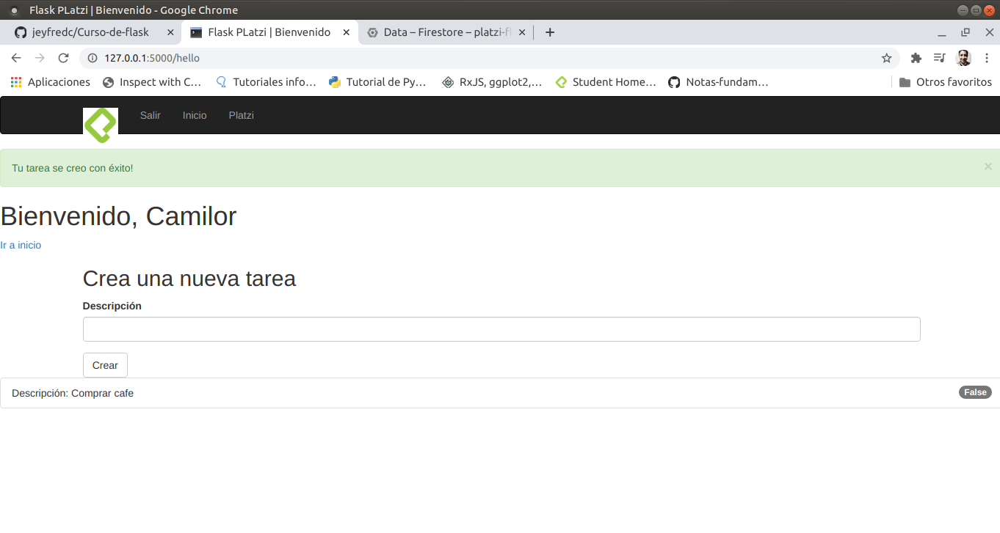

Y ahora hay que agregar el boton que diga borrar, el cual va a ser una forma y esta forma va hacer una accion la cual va a llamar a la funcion delete 

En el archivo **forms.py** crear una nueva clase que se llame `DeleteForm`

```
from flask_wtf import FlaskForm
from wtforms.fields import StringField, PasswordField, SubmitField
from wtforms.validators import DataRequired

class LoginForm(FlaskForm):
    username = StringField('Nombre de usuario', validators=[DataRequired()])
    password = PasswordField('Password', validators=[DataRequired()])
    submit = SubmitField('Enviar')


class TodoForm(FlaskForm):
    description = StringField('Descripción', validators=[DataRequired()])
    submit = SubmitField('Crear')


class DeleteTodoForm(FlaskForm):
    submit = SubmitField('Borrar')
```

La forma se debe pasar a la funcion hello del archivo **main.py**, para que la pueda utilizar el macro y se renderee en este. lo primero que hay que hacer es importar la forma `from app.forms import LoginForm, TodoForm, DeleteTodoForm` y luego crearla en el contexto de la funcion hello

```
import unittest
from flask import request, make_response,redirect, render_template, session, url_for, flash
from flask_login import login_required, current_user

from app import create_app
from app.forms import LoginForm, TodoForm, DeleteTodoForm
from app.firestore_service import get_users, get_todos, put_todo, delete_todo

app = create_app()


todos = ['Comprar cafe', 'Enviar solicitud de compra', 'Entregar video a productor']


@app.cli.command()
def test():
    tests = unittest.TestLoader().discover('tests')
    unittest.TextTestRunner().run(tests)


@app.errorhandler(404)
def not_found(error):
    return render_template('404.html', error=error)


@app.errorhandler(500)
def internal_server_error(error):
    return render_template('500.html', error=error)


@app.route('/')
def index():
    user_ip = request.remote_addr

    response = make_response(redirect('/hello'))

    session['user_ip'] = user_ip

    return response

@app.route('/hello', methods = ['GET', 'POST'])
@login_required
def hello():
    user_ip = session.get('user_ip')
    username = current_user.id
    todo_form = TodoForm()
    delete_form = DeleteTodoForm()

    context ={
        'user_ip': user_ip,
        'todos': get_todos(user_id=username),
        'username': username,
        'todo_form': todo_form,
        'delete_form': delete_form,
    }

    if todo_form.validate_on_submit():
        put_todo(user_id = username, description = todo_form.description.data)

        flash('Tu tarea se creo con éxito!')

        return redirect(url_for('hello'))

    return render_template('hello.html', **context)


@app.route('/todos/delete/<todo_id>', methods=['POST'])
def delete(todo_id):
    user_id = current_user.id
    delete_todo(user_id=user_id, todo_id=todo_id)

    return redirect(url_for('hello'))
```

Se aplica un ultimo cambio a **hello.html** para que reciba el delete cuando se accione

```





    {{ super() }}
    Bienvenido




    

        <h1>Bienvenido, {{ username | capitalize }}</h1> <!-- capitalize es para que la primer letra aparezca en mayuscula -->

    

    

        <h3>Tu Ip es {{ user_ip }}</h3>

    
        <a href="{{ url_for('index') }}">Ir a inicio</a>
    

    <div class="container">
        <h2>Crea una nueva tarea</h2>

        {{ wtf.quick_form(todo_form)}}
    </div>

    <ul class="list-group"> 
        
            {{macros.render_todo(todo, delete_form)}}
        
    </ul>

```

Tambien se debe traer a las macros importando Bootstrap en el archivo **macros.html**

```



    <li class="list-group-item">
        <span class="badge">{{ todo.to_dict().done }}</span>
        Descripción: {{todo.to_dict().description }}

        {{ wtf.quick_form(delete_form, action=url_for('delete', todo_id=todo.id)) }}
    </li>   

```

y ahora al recargar el navegador se puede crear y borrar una tarea

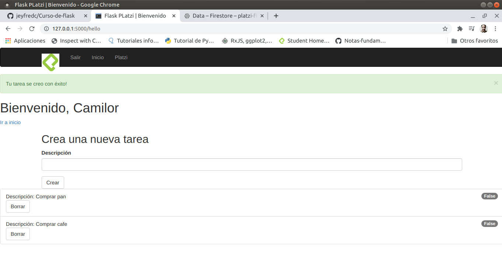

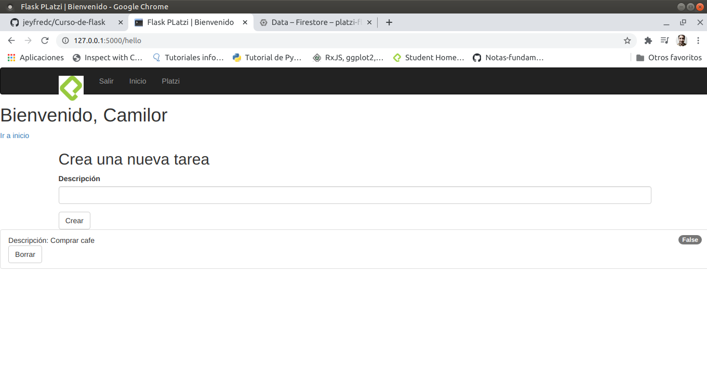

## Clase 34 Editar tareas

En esta clase se va a actualizar el Field done, el cual de momento aparece en estado falso

En el archivo **firestore_service.py**, se implementa la funcion `update_todo`, el cual recibe un user_id, un todo_id y un done, como se va a utilizar la variable `todo_ref`, se crea una funcion privada que se llama `_get_todo_ref()`, la cual recibe un user_id y un todo_id y la funcion regresa la referencia del todo y asi cambia lo que recibia anteriormente en la funcion `delete_todo` y tambien en `update_todo` y queda de la siguiente forma

**firestore_service.py**

```
import firebase_admin
from firebase_admin import credentials
from firebase_admin import firestore


project_id = 'platzi-flask-289823'

cred = credentials.ApplicationDefault()

firebase_admin.initialize_app(cred, {
  'projectId': project_id,
})

db = firestore.client()


def get_users():
    return db.collection('users').get()


def get_user(user_id):
    return db.collection('users').document(user_id).get()


def get_todos(user_id):
    return db.collection('users').document(user_id).collection('todos').get()


def user_put(user_data):
    user_ref = db.collection('users').document(user_data.username)
    user_ref.set({ 'password': user_data.password })


def put_todo(user_id, description):
    todos_collection_ref = db.collection('users').document(user_id).collection('todos')
    todos_collection_ref.add({'description': description, 'done': False })


def delete_todo(user_id, todo_id):
    #todo_ref = db.collection('users').document(user_id).collection('todos').document(todo_id)
    #Otra forma de establecer la ruta anterior es la siguiente
    todo_ref = _get_todo_ref(user_id, todo_id)
    todo_ref.delete()


def update_todo(user_id, todo_id, done):
    todo_done = not bool(done)
    todo_ref = _get_todo_ref(user_id, todo_id)
    todo_ref.update({'done': todo_done})


def _get_todo_ref(user_id, todo_id):
    return db.document('users/{}/todos/{}'.format(user_id, todo_id))
```

Dentro del archivo **main.py** se crea la funcion **update**, se debe importar la forma `from app.forms import TodoForm, DeleteTodoForm, UpdateTodoForm`, luego se debe integrar la forma en el contexto de la funcion hello

```
import unittest
from flask import request, make_response,redirect, render_template, session, url_for, flash
from flask_login import login_required, current_user

from app import create_app
from app.forms import TodoForm, DeleteTodoForm, UpdateTodoForm
from app.firestore_service import get_users, get_todos, put_todo, delete_todo

app = create_app()


todos = ['Comprar cafe', 'Enviar solicitud de compra', 'Entregar video a productor']


@app.cli.command()
def test():
    tests = unittest.TestLoader().discover('tests')
    unittest.TextTestRunner().run(tests)


@app.errorhandler(404)
def not_found(error):
    return render_template('404.html', error=error)


@app.errorhandler(500)
def internal_server_error(error):
    return render_template('500.html', error=error)


@app.route('/')
def index():
    user_ip = request.remote_addr

    response = make_response(redirect('/hello'))

    session['user_ip'] = user_ip

    return response

@app.route('/hello', methods = ['GET', 'POST'])
@login_required
def hello():
    user_ip = session.get('user_ip')
    username = current_user.id
    todo_form = TodoForm()
    delete_form = DeleteTodoForm()
    update_form = UpdateTodoForm()

    context ={
        'user_ip': user_ip,
        'todos': get_todos(user_id=username),
        'username': username,
        'todo_form': todo_form,
        'delete_form': delete_form,
        'update_form': update_form,
    }

    if todo_form.validate_on_submit():
        put_todo(user_id = username, description = todo_form.description.data)

        flash('Tu tarea se creo con éxito!')

        return redirect(url_for('hello'))

    return render_template('hello.html', **context)


@app.route('/todos/delete/<todo_id>', methods=['POST'])
def delete(todo_id):
    user_id = current_user.id
    delete_todo(user_id=user_id, todo_id=todo_id)

    return redirect(url_for('hello'))


@app.route('/todos/update/<todo_id>/<int:done>', methods=['POST'])
def update(todo_id, done):
    user_id = current_user.id

    pass
```

y ahora se debe rendear en **macros.html**, para eso se deben pasar los parametros de update_form e implementar con wtf adicionando el parametro done

```



    <li class="list-group-item">
        <span class="badge">{{ todo.to_dict().done }}</span>
        Descripción: {{todo.to_dict().description }}

        {{ wtf.quick_form(delete_form, action = url_for('delete', todo_id = todo.id)) }}
        {{ wtf.quick_form(update_form, action = url_for('update', todo_id = todo.id, done= todo.to_dict().done)) }}
    </li>   

```

Esto se debe hacer en **hello.html** pasando el parametro de update_form en el list_group

```





    {{ super() }}
    Bienvenido




    

        <h1>Bienvenido, {{ username | capitalize }}</h1> <!-- capitalize es para que la primer letra aparezca en mayuscula -->

    

    

        <h3>Tu Ip es {{ user_ip }}</h3>

    
        <a href="{{ url_for('index') }}">Ir a inicio</a>
    

    <div class="container">
        <h2>Crea una nueva tarea</h2>

        {{ wtf.quick_form(todo_form)}}
    </div>

    <ul class="list-group"> 
        
            {{ macros.render_todo(todo, delete_form, update_form) }}
        
    </ul>

```

En el archivo **main.py** se debe importar de **firestore_service.py**, la funcion update `from app.firestore_service import get_users, get_todos, put_todo, delete_todo, update_todo` y luego pasarlo por la funcion `update` del archivo main.py

```
import unittest
from flask import request, make_response,redirect, render_template, session, url_for, flash
from flask_login import login_required, current_user

from app import create_app
from app.forms import TodoForm, DeleteTodoForm, UpdateTodoForm
from app.firestore_service import get_users, get_todos, put_todo, delete_todo, update_todo

app = create_app()


todos = ['Comprar cafe', 'Enviar solicitud de compra', 'Entregar video a productor']


@app.cli.command()
def test():
    tests = unittest.TestLoader().discover('tests')
    unittest.TextTestRunner().run(tests)


@app.errorhandler(404)
def not_found(error):
    return render_template('404.html', error=error)


@app.errorhandler(500)
def internal_server_error(error):
    return render_template('500.html', error=error)


@app.route('/')
def index():
    user_ip = request.remote_addr

    response = make_response(redirect('/hello'))

    session['user_ip'] = user_ip

    return response

@app.route('/hello', methods = ['GET', 'POST'])
@login_required
def hello():
    user_ip = session.get('user_ip')
    username = current_user.id
    todo_form = TodoForm()
    delete_form = DeleteTodoForm()
    update_form = UpdateTodoForm()

    context ={
        'user_ip': user_ip,
        'todos': get_todos(user_id=username),
        'username': username,
        'todo_form': todo_form,
        'delete_form': delete_form,
        'update_form': update_form,
    }

    if todo_form.validate_on_submit():
        put_todo(user_id = username, description = todo_form.description.data)

        flash('Tu tarea se creo con éxito!')

        return redirect(url_for('hello'))

    return render_template('hello.html', **context)


@app.route('/todos/delete/<todo_id>', methods=['POST'])
def delete(todo_id):
    user_id = current_user.id
    delete_todo(user_id=user_id, todo_id=todo_id)

    return redirect(url_for('hello'))


@app.route('/todos/update/<todo_id>/<int:done>', methods=['POST'])
def update(todo_id, done):
    user_id = current_user.id

    update_todo(user_id=user_id, todo_id=todo_id, done=done)

    return redirect(url_for('hello')) 
```

Al recargar el navegador la dar click en Actualizar va a aparecer el estado de True o False

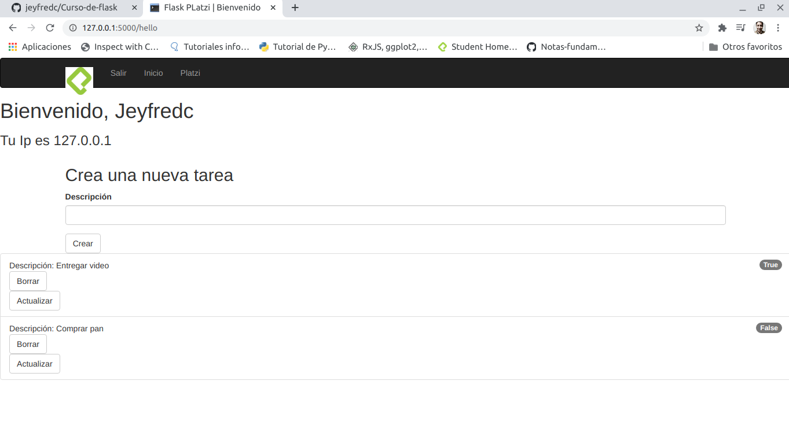

